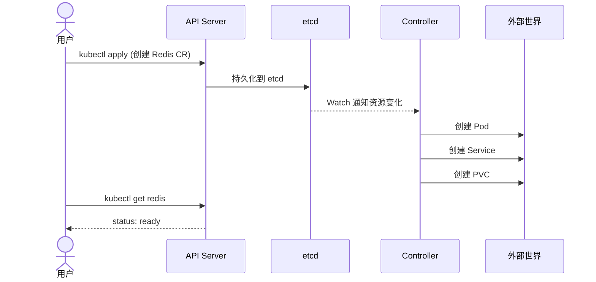

# 第 1 章：基础概念

## 1.1 Kubernetes 的资源模型

在 Kubernetes 中，一切皆资源。Pod、Service、Deployment、ConfigMap 这些都是"资源"。每个资源都有：

- **apiVersion**：API 组和版本，如 `apps/v1`
- **kind**：资源类型，如 `Deployment`
- **metadata**：名称、命名空间、标签等
- **spec**：期望状态
- **status**：当前实际状态

Kubernetes 的核心工作模式是**声明式 API** — 你告诉 K8S "我想要什么"（spec），它负责"变成那样"并把结果汇报给你（status）。

```yaml
# 一个典型的 K8S 资源
apiVersion: apps/v1
kind: Deployment
metadata:
  name: nginx
spec:           # 期望状态：我要 3 个副本
  replicas: 3
  selector:
    matchLabels:
      app: nginx
  template:     # Pod 模板
    ...
status:         # 实际状态：K8S 告诉你当前运行情况
  replicas: 3
  readyReplicas: 3
```

## 1.2 什么是 CRD？

**CRD（Custom Resource Definition）** 允许你在 Kubernetes 中定义自己的资源类型。K8S 内置了 Deployment、Service 等资源，但当你需要管理自己的业务逻辑时（比如 Redis 集群、数据库备份、证书管理），内置资源就不够用了。

CRD 让你可以：

1. 定义一个全新的资源类型，比如 `kind: Redis`
2. 用熟悉的 `kubectl` 命令操作它
3. 享受 K8S 的 RBAC、审计、API 版本管理等所有能力

```yaml
# 把一个普通的 Deployment 变成你想要的任何东西
apiVersion: cache.example.com/v1
kind: Redis          # <-- 这是你定义的资源
metadata:
  name: my-redis
spec:
  memory: "2Gi"
  version: "7.0"
  persistence: true
```

## 1.3 什么是 Controller？

CRD 只定义了数据结构，还需要有人来"响应"这个资源的变化。这就是 **Controller**。

Controller 的工作是一个死循环，叫做 **Reconcile Loop（调谐循环）**：

```
for {
    读取资源的 spec（期望状态）
    读取实际世界的状态（当前状态）
    if spec == actual {
        什么都不做
    } else {
        执行操作，让 actual 向 spec 靠拢
    }
    sleep(一段时间)
}
```

以 Deployment Controller 为例：
- 你创建 Deployment，`spec.replicas = 3`
- Controller 发现当前只有 1 个 Pod 在运行
- 它创建 2 个新 Pod，让 actual 趋近 spec
- 如果有 Pod 挂了，它会再次创建新的

## 1.4 什么是 Operator？

**Operator = CRD + Controller + 领域知识**

Operator 模式最早由 CoreOS（后被 Red Hat 收购）提出。一个 Operator 不仅仅做机械的调谐，它还内置了对特定软件的运维知识。

比如 Redis Operator 知道：
- 如何配置 Redis 主从复制
- 如何进行不停机的版本升级
- 如何做数据备份和恢复
- 当 master 挂了如何自动故障转移

## 1.5 一个直观的类比

| 概念 | 类比 |
|------|------|
| K8S 内置资源 | 乐高积木的基本块（正方形、长方形） |
| CRD | 自定义形状的积木模具 |
| CR（Custom Resource） | 用模具造出来的积木块 |
| Controller | 一个机器人手臂，看到图纸（spec）就拼装积木 |
| Operator | 一个懂建筑学的机器人，会判断结构的合理性 |

## 1.6 核心工作流



每一步：
1. 用户通过 `kubectl apply` 创建 CR 实例
2. API Server 将其持久化到 etcd
3. Controller 通过 Watch 机制收到资源变更通知
4. Controller 执行调谐逻辑，创建/更新/删除底层资源
5. CR 的 status 字段被更新，用户可查询状态

## 1.7 本章小结

- **CRD** = 定义你自己的 Kubernetes 资源类型
- **Controller** = 实现 Reconcile Loop，保证实际状态匹配期望状态
- **Operator** = CRD + Controller + 领域运维知识
- 整个机制依赖 K8S 的声明式 API 和 etcd Watch 机制

下一章，我们搭建开发环境。
