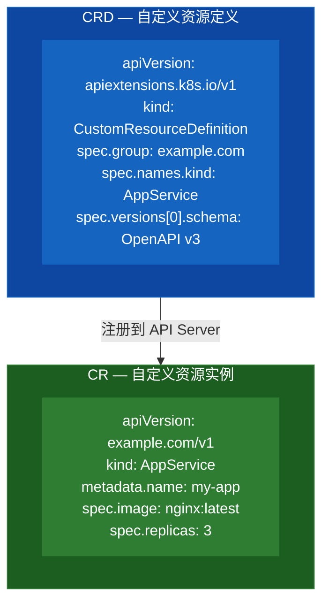

# 01 — CRD 基础：从 YAML 理解自定义资源

## 什么是 CRD？

**CRD (Custom Resource Definition)** 允许你向 Kubernetes API 注册自定义资源类型。

类比理解：
- Kubernetes 内置了 `Deployment`、`Service`、`Pod` 等资源类型
- CRD 让你创建自己的资源类型，比如 `AppService`、`MySQLCluster`、`Certificate`
- 注册后，你就可以用 `kubectl get appservices` 来操作你的自定义资源了

## 核心概念



## 实验 1：创建你的第一个 CRD

### 目标

创建一个 `AppService` CRD，它代表一个简单的 Web 应用，字段包括：
- `image`：容器镜像
- `replicas`：副本数
- `port`：服务端口

### 步骤 1：查看 CRD YAML

查看项目中的 `appservice-crd.yaml`。关键部分：

```yaml
spec:
  group: example.com          # API 组
  names:
    kind: AppService          # Kind 名称
    plural: appservices       # 复数（用于 kubectl get appservices）
    singular: appservice      # 单数
    shortNames: ["as"]        # 短名（kubectl get as）
  scope: Namespaced           # 命名空间级别
  versions:
    - name: v1
      served: true            # 是否提供此版本
      storage: true           # 是否持久化此版本
      schema:
        openAPIV3Schema:      # 字段校验
          type: object
          properties:
            spec:
              type: object
              properties:
                image:
                  type: string
                replicas:
                  type: integer
                  minimum: 1
                port:
                  type: integer
                  minimum: 1
                  maximum: 65535
              required:
                - image
                - replicas
```

### 步骤 2：部署 CRD

```bash
# 确认当前集群上下文
kubectl config current-context

# 部署 CRD
kubectl apply -f appservice-crd.yaml

# 查看已注册的 CRD
kubectl get crd | grep appservice

# 查看 CRD 详情
kubectl describe crd appservices.example.com
```

### 步骤 3：创建自定义资源实例

```bash
# 创建一个 AppService 实例
kubectl apply -f appservice-instance.yaml

# 查看你的自定义资源！
kubectl get appservices
# 或使用短名
kubectl get as

# 查看详情
kubectl describe appservice my-nginx

# 以 YAML 格式查看
kubectl get appservice my-nginx -o yaml
```

### 步骤 4：尝试 API 直接访问

```bash
# 通过 API 访问你的自定义资源
kubectl get --raw /apis/example.com/v1/namespaces/default/appservices

# 查看 API 发现
kubectl api-resources | grep example.com
```

### 步骤 5：测试校验

```bash
# 尝试创建一个无效的实例（缺少必填字段 image）
kubectl apply -f - <<EOF
apiVersion: example.com/v1
kind: AppService
metadata:
  name: test-invalid
spec:
  replicas: 1
EOF

# 预期错误输出（API Server 校验拒绝）：
# Error from server (Invalid): error when creating "STDIN":
#   AppService.example.com "test-invalid" is invalid: <nil>: Invalid value:...
#   ...spec.image in body is required

# 再试一个：超出范围的端口号
kubectl apply -f - <<EOF
apiVersion: example.com/v1
kind: AppService
metadata:
  name: test-invalid-2
spec:
  image: nginx
  replicas: 1
  port: 99999
EOF

# 预期错误输出：
# Error from server (Invalid): error when creating "STDIN":
#   AppService.example.com "test-invalid-2" is invalid:
#   spec.port: Invalid value: 99999: spec.port in body should be less than or equal to 65535
```

## 关键知识点

### 1. scope 的作用

- `Namespaced`：资源属于某个命名空间（如 Deployment）
- `Cluster`：资源是集群级别的（如 Node、PV）

### 2. served vs storage

```yaml
versions:
  - name: v1alpha1
    served: true      # 允许创建，但不持久化
    storage: false
  - name: v1
    served: true
    storage: true     # 持久化版本（只能有一个）
```

### 3. Schema 校验

CRD 使用 **OpenAPI v3 Schema** 进行字段校验，支持：
- 类型校验（string, integer, boolean, array, object）
- 必填字段（required）
- 范围限制（minimum, maximum）
- 枚举（enum）
- 正则匹配（pattern）

### 4. subresources（子资源）

CRD 支持以下子资源：
- `status`：状态子资源，spec 和 status 分开更新
- `scale`：支持 `kubectl scale` 命令

## 当前状态

此时，Kubernetes 只负责：
- ✅ 存储你的自定义资源
- ✅ 校验字段合法性
- ❌ **不会**自动创建 Deployment
- ❌ **不会**自动创建 Service

这就是为什么需要 **Controller / Operator** → 下一章！

## 清理

```bash
# 删除 CR 实例
kubectl delete appservice my-nginx

# 删除 CRD（会同时删除所有该类型的 CR）
kubectl delete crd appservices.example.com
```

> **不要现在清理**，下一章会继续使用这个 CRD。

---

下一章：[02-手动控制器](../02-manual-controller/README.md) — 用 Shell 脚本实现 Reconcile 循环
