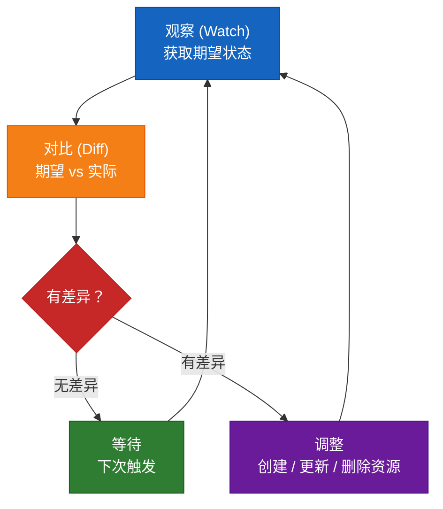
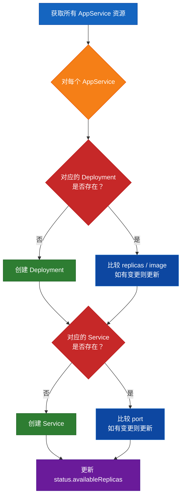
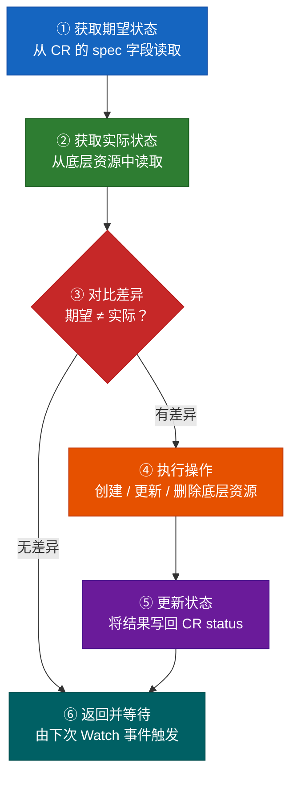

# 02 — 手动控制器：用 Shell 理解 Reconcile 循环

## 什么是 Controller/Operator？

**Controller（控制器）** 是一个循环进程，它持续观察资源的状态，并将"实际状态"调整为"期望状态"。

这个模式叫做 **Reconcile Loop（调谐循环）**：



## 关键理解

在 Kubernetes 中，所有的内置控制器都遵循这个模式：

| 资源 | 控制器 | 做什么 |
|------|--------|--------|
| Deployment | Deployment Controller | 创建 ReplicaSet |
| ReplicaSet | ReplicaSet Controller | 创建 Pod |
| Node | Node Controller | 监控节点健康 |
| Service | Endpoints Controller | 管理 Endpoints |

**Operator = CRD + Controller**，只是把这种模式扩展到了自定义资源。

## 实验 2：Shell 控制器

我们将写一个 Shell 脚本，手动执行 Reconcile 循环。这不是生产级方案，但能帮助你深刻理解控制器的工作原理。

### 控制器的职责

当用户创建一个 `AppService` 时，控制器需要：

1. **创建/更新 Deployment** — 根据 `spec.image` 和 `spec.replicas`
2. **创建/更新 Service** — 根据 `spec.port`
3. **更新 Status** — 将实际状态写回 CR 的 `status` 字段

### reconcile.sh 的工作流程



### 步骤 1：部署 CRD

```bash
# 确保 CRD 已部署
kubectl apply -f ../01-crd-basics/appservice-crd.yaml

# 创建测试实例
kubectl apply -f - <<EOF
apiVersion: example.com/v1
kind: AppService
metadata:
  name: my-nginx
spec:
  image: nginx:latest
  replicas: 2
  port: 80
EOF
```

### 步骤 2：运行 Shell 控制器

```bash
# 先看一下 reconcile 脚本
cat reconcile.sh

# 手动执行一次 reconcile
chmod +x reconcile.sh
./reconcile.sh
```

### 步骤 3：验证结果

```bash
# 检查 Deployment 是否被创建
kubectl get deployment

# 检查 Service 是否被创建
kubectl get svc

# 检查 Pod
kubectl get pods

# 查看 CR 的 status 是否被更新
# 提示：yq 是可选工具（brew install yq），也可用 kubectl 自带 jsonpath：
kubectl get appservice my-nginx -o yaml | yq '.status'
# 或者：
kubectl get appservice my-nginx -o jsonpath='{.status}'
```

如果你看到 Deployment 和 Service 被自动创建，说明你的第一个控制器工作正常！

### 步骤 4：测试变更响应

```bash
# 修改副本数从 2 → 3
kubectl patch appservice my-nginx --type merge -p '{"spec":{"replicas":3}}'

# 再次运行 reconcile
./reconcile.sh

# 检查 Deployment 副本数是否更新
kubectl get deployment my-nginx

# 修改镜像
kubectl patch appservice my-nginx --type merge -p '{"spec":{"image":"nginx:alpine"}}'

# 再次 reconcile
./reconcile.sh

# 检查 Deployment 镜像是否更新
kubectl get deployment my-nginx -o yaml | yq '.spec.template.spec.containers[0].image'
```

### 步骤 5：测试删除

```bash
# 删除 AppService CR
kubectl delete appservice my-nginx

# 注意：Shell 控制器不会自动清理关联资源
# 这就是 OwnerReference 的用途（后面会讲）
kubectl get deployment
kubectl get svc

# 手动清理
kubectl delete deployment my-nginx
kubectl delete svc my-nginx
```

## Shell 控制器的局限性

| 问题 | 说明 |
|------|------|
| ❌ 非实时 | 需要手动执行，不能自动 Watch |
| ❌ 无故障恢复 | 脚本失败不会重试 |
| ❌ 无并发安全 | 多实例运行可能冲突 |
| ❌ 无所有权管理 | 删除 CR 不会自动清理关联资源 |
| ❌ 无 Finalizer | 无法实现清理逻辑 |

这些正是我们在下一章要用 Go Operator 解决的问题。

## 控制器核心模式总结



---

下一章：[03-Go Operator 实战](../03-go-operator/README.md) — 构建生产级 Operator
