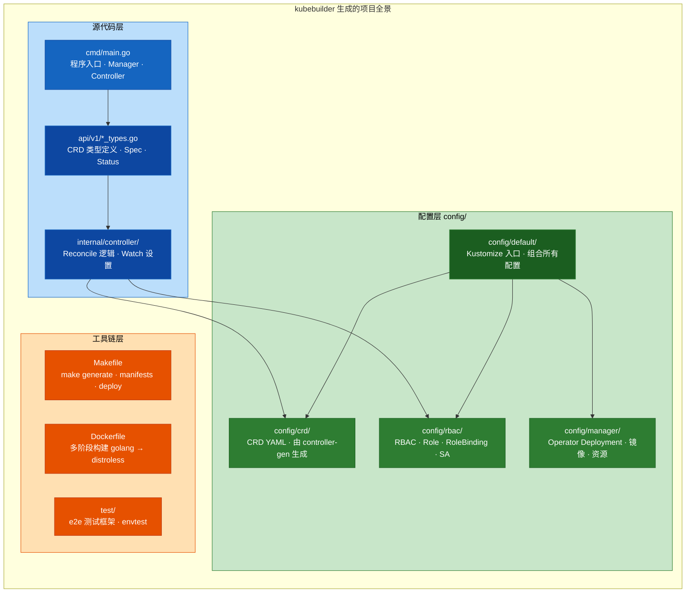
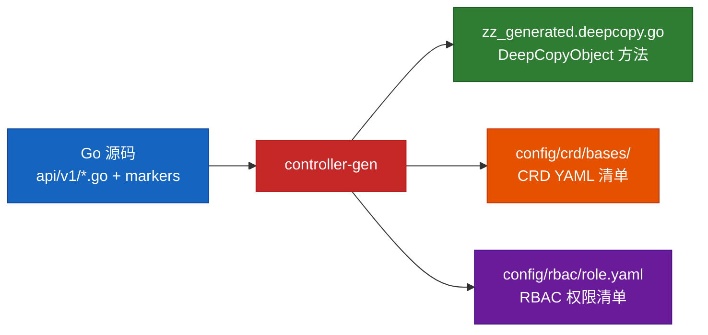
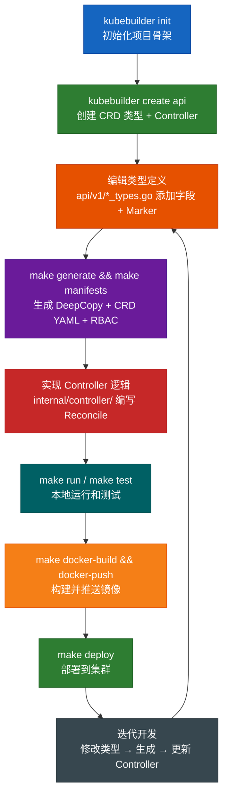

# 03 — Go Operator 实战：构建生产级 Operator

## 目录

- [技术栈](#技术栈)
- [Part A：kubebuilder 脚手架快速初始化](#part-akubebuilder-脚手架快速初始化)
- [Part B：脚手架生成的项目结构详解](#part-b脚手架生成的项目结构详解)
- [Part C：核心组件解析](#part-c核心组件解析)
- [Part D：手动项目结构（本项目实际结构）](#part-d手动项目结构本项目实际结构)
- [Part E：编译、运行与测试](#part-e编译运行与测试)
- [Part F：部署到集群](#part-f部署到集群)

---

## 技术栈

- **Go 1.21+**
- **controller-runtime** (sigs.k8s.io/controller-runtime) — Kubernetes 官方推荐的控制器库
- **kubebuilder** — 官方脚手架工具，一键生成项目框架和代码

---

## Part A：kubebuilder 脚手架快速初始化

### kubebuilder 是什么？

kubebuilder 是 Kubernetes SIG 维护的官方 Operator 脚手架工具。它可以：

- 一键生成标准化的 Operator 项目结构
- 从 Go struct + Marker 注释自动生成 CRD YAML、RBAC 清单
- 生成 DeepCopy 方法（controller-gen）
- 提供本地开发、测试、构建、部署的完整 Makefile
- 内置 Webhook、多版本转换、Admission 等支持

### 安装 kubebuilder

```bash
# macOS
brew install kubebuilder

# Linux
curl -L -o kubebuilder "https://go.kubebuilder.io/dl/latest/$(go env GOOS)/$(go env GOARCH)"
chmod +x kubebuilder
sudo mv kubebuilder /usr/local/bin/

# 验证安装
kubebuilder version
```

### 第一步：kubebuilder init — 初始化项目

```bash
# 创建项目目录
mkdir appservice-operator && cd appservice-operator

# 初始化 Go module + Operator 项目
kubebuilder init \
  --domain example.com \
  --repo github.com/example/appservice-operator \
  --owner "your-name"

# 参数说明：
#   --domain   : CRD 的 API Group 域名（最终 API Group = example.com）
#   --repo     : Go module 路径
#   --owner    : 代码中版权注释的所有者
```

**执行后 kubebuilder 会生成以下文件：**

```
appservice-operator/
├── .dockerignore
├── .gitignore
├── .golangci.yml              # lint 配置
├── Dockerfile                 # 容器构建文件
├── Makefile                   # 构建、测试、部署一站式命令
├── PROJECT                    # kubebuilder 项目元数据
├── README.md
├── cmd/
│   └── main.go                # 入口文件：Manager + Controller 注册
├── config/
│   ├── default/               # Kustomize 叠加层（包含所有配置）
│   │   ├── kustomization.yaml
│   │   ├── manager_auth_proxy_patch.yaml
│   │   └── manager_config_patch.yaml
│   ├── manager/
│   │   ├── kustomization.yaml
│   │   └── manager.yaml       # Operator Deployment 清单
│   ├── prometheus/
│   │   ├── kustomization.yaml
│   │   └── monitor.yaml       # ServiceMonitor
│   └── rbac/                  # RBAC 基础配置
│       ├── kustomization.yaml
│       ├── leader_election_role.yaml
│       ├── leader_election_role_binding.yaml
│       ├── role.yaml
│       ├── role_binding.yaml
│       └── service_account.yaml
├── go.mod
├── go.sum
├── hack/
│   └── boilerplate.go.txt     # 代码文件头模板
└── test/
    ├── e2e/                   # 端到端测试
    │   └── e2e_suite_test.go
    └── utils/                 # 测试工具
        └── utils.go
```

### 第二步：kubebuilder create api — 创建 CRD 类型和 Controller

```bash
# 创建 API 类型（CRD 的 Go 定义）和对应的 Controller
kubebuilder create api \
  --group example \
  --version v1 \
  --kind AppService \
  --resource true \
  --controller true

# 参数说明：
#   --group      : API Group 中的组名（结合 init 的 domain → example.com）
#   --version    : API 版本
#   --kind       : 资源类型名（生成的 Go struct 名）
#   --resource   : true = 生成 CRD 类型定义文件
#   --controller : true = 生成 Controller 骨架文件
```

**执行后新增的文件：**

```
api/
└── v1/
    ├── appservice_types.go          # ← CRD 类型定义（你主要编辑的文件）
    ├── groupversion_info.go         # ← API Group + Version 注册
    └── zz_generated.deepcopy.go     # ← 自动生成的 DeepCopy 方法
internal/
└── controller/
    ├── appservice_controller.go     # ← Controller 骨架（你主要编辑的文件）
    └── suite_test.go                # ← Controller 单元测试骨架
config/
├── crd/
│   └── kustomization.yaml           # ← CRD 的 Kustomize 配置
├── rbac/
│   └── appservice_editor_role.yaml  # ← 查看/编辑 CR 的 RBAC
│   └── appservice_viewer_role.yaml  # ← 只读查看 CR 的 RBAC
└── samples/
    └── example_v1_appservice.yaml   # ← CR 示例 YAML
```

### 第三步：编辑类型定义

在 `api/v1/appservice_types.go` 中编辑 `AppServiceSpec` 和 `AppServiceStatus`：

```go
// AppServiceSpec defines the desired state of AppService
type AppServiceSpec struct {
    // +kubebuilder:validation:Required
    // +kubebuilder:validation:Minimum=1
    // +kubebuilder:default=1
    Image string `json:"image"`

    // +kubebuilder:validation:Required
    // +kubebuilder:validation:Minimum=1
    // +kubebuilder:default=1
    Replicas int32 `json:"replicas"`

    // +kubebuilder:validation:Minimum=1
    // +kubebuilder:validation:Maximum=65535
    // +kubebuilder:default=80
    Port int32 `json:"port,omitempty"`
}

// AppServiceStatus defines the observed state of AppService
type AppServiceStatus struct {
    AvailableReplicas int32              `json:"availableReplicas,omitempty"`
    Conditions        []metav1.Condition `json:"conditions,omitempty"`
}
```

### 第四步：重新生成代码和清单

每次修改类型定义后，运行：

```bash
# 重新生成 DeepCopy、CRD YAML、RBAC、Webhook 等
make generate    # 生成 DeepCopy 方法
make manifests   # 生成 CRD YAML + RBAC + Webhook 配置
```

`make generate` 实际执行：
```bash
controller-gen object:headerFile="hack/boilerplate.go.txt" paths="./..."
```

`make manifests` 实际执行：
```bash
controller-gen rbac:roleName=manager-role crd webhook paths="./..." output:crd:artifacts:config=config/crd/bases
```

### 第五步：实现 Controller 逻辑

在 `internal/controller/appservice_controller.go` 中实现 `Reconcile` 方法（详见 Part C）。

### 第六步：运行测试

```bash
# 本地运行（连接你的 k8s 集群）
make run

# 安装 CRD 到集群
make install

# 运行单元测试
make test
```

---

## Part B：脚手架生成的项目结构详解



### 关键文件深度解析

#### 1. `PROJECT` — kubebuilder 项目清单

```yaml
domain: example.com
layout:
- go.kubebuilder.io/v4
projectName: appservice-operator
repo: github.com/example/appservice-operator
version: "3"
```

这个文件记录了项目的 kubebuilder 版本、布局版本等，后续再次运行 `kubebuilder create api` 时需要它。

#### 2. `cmd/main.go` — 程序骨架

kubebuilder 生成的 main.go 已经包含完整的初始代码，你需要做的只是取消注释并注册你的 Controller：

```go
func main() {
    // ... Manager 创建 ...

    // 注册你的 Controller（kubebuilder create api 后取消这行注释）
    if err = (&controller.AppServiceReconciler{
        Client: mgr.GetClient(),
        Scheme: mgr.GetScheme(),
    }).SetupWithManager(mgr); err != nil {
        setupLog.Error(err, "unable to create controller", "controller", "AppService")
        os.Exit(1)
    }

    // ... 启动 ...
}
```

#### 3. `config/` 目录 — Kustomize 配置体系

kubebuilder 使用 **Kustomize** 管理所有 Kubernetes 清单，分层结构：

```
config/
├── default/kustomization.yaml    # 顶层入口，引用下面所有资源
│   resources:
│     - ../crd                    # 引入 CRD
│     - ../rbac                   # 引入 RBAC
│     - ../manager                # 引入 Operator Deployment
├── crd/kustomization.yaml        # CRD 清单
├── rbac/kustomization.yaml       # RBAC 清单
│   - service_account.yaml        # ServiceAccount
│   - role.yaml                   # ClusterRole（由 controller-gen 生成）
│   - role_binding.yaml           # ClusterRoleBinding
│   - leader_election_role.yaml   # Leader Election 权限
├── manager/manager.yaml          # Operator 的 Deployment
│   spec:
│     containers:
│       - name: manager
│         image: controller:latest
│         args:
│           - --leader-elect
└── prometheus/monitor.yaml       # Prometheus ServiceMonitor
```

#### 4. `Makefile` — 常用命令一览

| 命令 | 作用 | 实际执行 |
|------|------|----------|
| `make generate` | 生成 DeepCopy | `controller-gen object paths=./...` |
| `make manifests` | 生成 CRD + RBAC | `controller-gen crd rbac webhook paths=./... output:crd:artifacts:config=config/crd/bases` |
| `make install` | 安装 CRD 到集群 | `kustomize build config/crd \| kubectl apply -f -` |
| `make uninstall` | 卸载 CRD | `kustomize build config/crd \| kubectl delete -f -` |
| `make deploy` | 部署 Operator | `kustomize build config/default \| kubectl apply -f -` |
| `make undeploy` | 卸载 Operator | `kustomize build config/default \| kubectl delete -f -` |
| `make run` | 本地运行 | `go run ./cmd/main.go` |
| `make build` | 编译二进制 | `go build -o bin/manager cmd/main.go` |
| `make docker-build` | 构建镜像 | `docker build -t controller:latest .` |
| `make docker-push` | 推送镜像 | `docker push controller:latest` |
| `make test` | 运行测试 | `go test ./...` |

### controller-gen：代码生成引擎

kubebuilder 的核心代码生成工具是 `controller-gen`。它通过解析 Go 源码中的 **Marker 注释** 来生成代码：



Marker 注释示例：
```go
// +kubebuilder:validation:Required    → CRD schema 中此字段必填
// +kubebuilder:validation:Minimum=1   → CRD schema 中此字段最小值
// +kubebuilder:subresource:status     → 为 CRD 启用 /status 子资源
// +kubebuilder:rbac:groups=apps,resources=deployments,verbs=get;list;watch;create;update
//                                      → 生成对应的 RBAC 规则
// +kubebuilder:printcolumn:name="Image",type="string",JSONPath=".spec.image"
//                                      → kubectl get 时的打印列
```

---

## Part C：核心组件解析

### 1. Type 定义 (`api/v1/appservice_types.go`)

Go struct 通过 `+kubebuilder` 标记（markers）定义 CRD Schema：

```go
// +kubebuilder:object:root=true
// +kubebuilder:subresource:status
// +kubebuilder:resource:shortName=as

// AppService is the Schema for the appservices API
type AppService struct {
    metav1.TypeMeta   `json:",inline"`
    metav1.ObjectMeta `json:"metadata,omitempty"`

    Spec   AppServiceSpec   `json:"spec,omitempty"`
    Status AppServiceStatus `json:"status,omitempty"`
}

type AppServiceSpec struct {
    // +kubebuilder:validation:Required
    // +kubebuilder:validation:Minimum=1
    Image    string `json:"image"`

    // +kubebuilder:validation:Minimum=1
    Replicas int32  `json:"replicas"`

    // +kubebuilder:validation:Minimum=1
    // +kubebuilder:validation:Maximum=65535
    Port     int32  `json:"port,omitempty"`
}
```

这些 markers 会被 `controller-gen` 处理，生成 CRD YAML 和 DeepCopy 方法。

### 2. Controller (`internal/controller/appservice_controller.go`)

这是 Operator 的核心。kubebuilder 生成骨架用 `TODO` 标记了需要你填充的地方：

```go
func (r *AppServiceReconciler) Reconcile(ctx context.Context, req ctrl.Request) (ctrl.Result, error) {
    logger := log.FromContext(ctx)

    // TODO(user): your logic here — kubebuilder 生成的占位符

    // 1. 获取 AppService CR
    var appService appsv1.AppService
    if err := r.Get(ctx, req.NamespacedName, &appService); err != nil {
        return ctrl.Result{}, client.IgnoreNotFound(err)
    }

    // 2. Reconcile Deployment（你自己实现的业务逻辑）
    if err := r.reconcileDeployment(ctx, &appService); err != nil {
        return ctrl.Result{}, err
    }

    // 3. Reconcile Service
    if err := r.reconcileService(ctx, &appService); err != nil {
        return ctrl.Result{}, err
    }

    // 4. Update Status
    if err := r.updateStatus(ctx, &appService); err != nil {
        return ctrl.Result{}, err
    }

    return ctrl.Result{}, nil
}
```

### 3. Watch 设置（SetupWithManager）

kubebuilder 生成 `SetupWithManager` 骨架，你需要配置 Watch 关系：

```go
func (r *AppServiceReconciler) SetupWithManager(mgr ctrl.Manager) error {
    return ctrl.NewControllerManagedBy(mgr).
        For(&appsv1.AppService{}).       // 主 Watch：AppService CR
        Owns(&appsv1k8s.Deployment{}).   // 辅助 Watch：由本 Controller 创建的 Deployment
        Owns(&corev1.Service{}).         // 辅助 Watch：由本 Controller 创建的 Service
        Complete(r)
}
```

### 4. 关键设计：Owner Reference

```go
// 设置 OwnerReference，使得 CR 被删除时，关联资源自动被 GC 清理
func (r *AppServiceReconciler) setOwnerReference(obj client.Object, appService *appsv1.AppService) error {
    return controllerutil.SetControllerReference(appService, obj, r.Scheme)
}
```

### 5. Requeue 与错误处理

```go
// Requeue 模式：
// - 返回 error → 指数退避重试
// - 返回 ctrl.Result{Requeue: true} → 立即重试
// - 返回 ctrl.Result{RequeueAfter: time.Minute} → 延迟重试
// - 返回 ctrl.Result{} → 不重试（等待下一个 Watch 事件）
```

---

## Part D：手动项目结构

> **注意**：本项目位于 `03-go-operator/`，使用的是**手动裁剪过的简化结构**。
> 学习 kubebuilder 脚手架后，推荐使用 Part A 生成的完整标准项目结构。

本项目的简化结构 vs kubebuilder 标准结构的对照：

| 功能 | kubebuilder 标准位置 | 本项目位置 |
|------|---------------------|-----------|
| 入口文件 | `cmd/main.go` | `main.go`（项目根目录） |
| 类型定义 | `api/v1/*_types.go` | `api/v1/appservice_types.go` |
| Controller | `internal/controller/` | `internal/controller/` |
| CRD 清单 | `config/crd/bases/` | `config/crd/bases.yaml` |
| RBAC | `config/rbac/` | `config/rbac/role.yaml` |
| Kustomize | `config/default/` | ❌ 无（直接用 kubectl apply） |
| Makefile | ✅ 完整 Makefile | ✅ 简化 Makefile |

```
03-go-operator/
├── main.go                          # 入口：启动 Manager + Controller
├── go.mod / go.sum                  # Go 依赖管理
├── Makefile                         # 简化的构建命令
├── Dockerfile                       # 容器化
├── api/
│   └── v1/
│       ├── appservice_types.go      # CRD 类型定义（Go struct + markers）
│       ├── groupversion_info.go     # API Group 注册
│       └── zz_generated.deepcopy.go # DeepCopy 方法
├── internal/
│   └── controller/
│       └── appservice_controller.go # 核心 Reconcile 逻辑（400+ 行注释）
└── config/
    ├── crd/
    │   └── bases.yaml               # CRD 的 YAML 定义
    └── rbac/
        └── role.yaml                # RBAC 权限
```

---

## Part E：编译、运行与测试

### 步骤 1：使用 kubebuilder 工作流（推荐）

```bash
# 如果你用 kubebuilder 初始化了项目：
cd kubebuilder-project

# 生成代码（修改类型定义后必须执行）
make generate
make manifests

# 安装 CRD 到 f2e-k8s-cluster
kubectl config use-context f2e-k8s-cluster
make install

# 本地运行 Operator
make run
```

### 步骤 2：使用本项目手动构建

```bash
cd /Users/hy/Dev/crds/03-go-operator

# 下载依赖
go mod tidy

# 验证编译
go build -o appservice-operator .

# 生成 CRD YAML（如果安装了 controller-gen）
controller-gen crd paths=./api/v1 output:crd:artifacts:config=config/crd
controller-gen rbac:roleName=appservice-operator paths=./internal/controller output:rbac:artifacts:config=config/rbac

# 部署 CRD 到集群
kubectl apply -f config/crd/bases.yaml
kubectl apply -f config/rbac/role.yaml

# 本地运行
go run main.go
```

### 步骤 3：创建 CR 测试

在另一个终端中：

```bash
# 创建 AppService 实例
kubectl apply -f - <<EOF
apiVersion: example.com/v1
kind: AppService
metadata:
  name: test-go-operator
spec:
  image: nginx:latest
  replicas: 3
  port: 8080
EOF

# 观察 Operator 日志，应该看到 Reconcile 被触发
# Operator 会自动创建 Deployment 和 Service

# 验证
kubectl get appservices
kubectl get deployment test-go-operator
kubectl get svc test-go-operator
kubectl get pods -l app=test-go-operator
```

### 步骤 4：测试自动响应

```bash
# 修改副本数 → Operator 自动更新 Deployment
kubectl patch appservice test-go-operator --type merge -p '{"spec":{"replicas":5}}'
kubectl get deployment test-go-operator  # 应该变成 5

# 修改镜像 → Operator 自动滚动更新
kubectl patch appservice test-go-operator --type merge -p '{"spec":{"image":"nginx:alpine"}}'
kubectl get deployment test-go-operator -o jsonpath='{.spec.template.spec.containers[0].image}'

# 删除 Deployment → Operator 自动重建（Owns Watch）
kubectl delete deployment test-go-operator
kubectl get deployment test-go-operator  # 几秒后自动恢复

# 删除 CR → 关联资源级联删除（OwnerReference GC）
kubectl delete appservice test-go-operator
kubectl get deployment test-go-operator  # NotFound
```

---

## Part F：部署到集群

### kubebuilder 标准部署（推荐）

```bash
# 设置镜像仓库
export IMG=your-registry/appservice-operator:v0.1.0

# 构建并推送镜像
make docker-build docker-push IMG=$IMG

# 一键部署 CRD + RBAC + Operator Deployment
make deploy IMG=$IMG

# 查看部署状态
kubectl get deployment -n appservice-operator-system
kubectl logs -n appservice-operator-system deployment/appservice-operator-controller-manager
```

### 手动部署

```bash
kubectl apply -f config/crd/bases.yaml
kubectl apply -f config/rbac/role.yaml
kubectl apply -f config/manager/manager.yaml
```

---

## kubebuilder 工作流全景



---

## 总结：两种学习路径

| 路径 | 方式 | 适合 |
|------|------|------|
| **自学路径** | 从零手写每个文件（本项目的方式） | 深入理解每个组件的作用，适合学习原理 |
| **工程路径** | kubebuilder init → create api → 专注 Reconcile | 快速上手，适合实际项目开发 |

**建议**：先用 kubebuilder 生成一个完整项目，对照本项目的代码理解每个文件的作用，然后专注于实现 `Reconcile` 方法。

---

下一章：[04-进阶主题](../04-advanced/README.md) — Webhook、多版本、Validation 等
