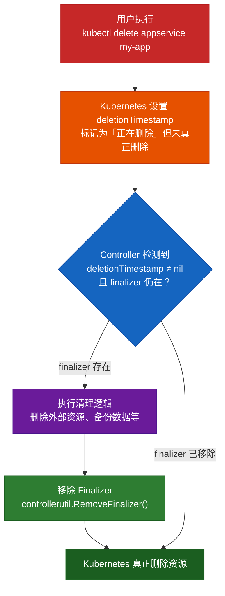

# 04 — 进阶主题

## 目录

1. [Status 子资源与 Condition](#1-status-子资源与-condition)
2. [Finalizer — 资源清理钩子](#2-finalizer--资源清理钩子)
3. [Webhook — 准入控制](#3-webhook--准入控制)
4. [多版本转换](#4-多版本转换)
5. [Leader Election — 高可用部署](#5-leader-election--高可用部署)
6. [常见生产问题](#6-常见生产问题)

---

## 1. Status 子资源与 Condition

### 为什么需要 Status 子资源？

没有 Status 子资源时，spec 和 status 共享同一个更新路径。如果 Operator 想更新 status，而用户同时修改了 spec，可能发生冲突。

```yaml
# 在 CRD 中启用 Status 子资源
spec:
  versions:
    - name: v1
      subresources:
        status: {}   # ← 关键配置
```

启用后：
- `kubectl replace` 只能修改 spec
- `kubectl patch --subresource=status` 只能修改 status
- 两者互不冲突

### Condition 约定

Kubernetes API 约定使用标准化的 Condition 类型：

```go
// 推荐的 READY Condition
meta.SetStatusCondition(&cr.Status.Conditions, metav1.Condition{
    Type:    "Ready",       // 条件类型
    Status:  metav1.ConditionTrue,  // True / False / Unknown
    Reason:  "DeploymentReady",     // 机器可读的原因
    Message: "Deployment has minimum availability",
    ObservedGeneration: cr.Generation,  // 观察到的代数
})
```

常见的 Condition 类型：
| Type | 含义 |
|------|------|
| `Ready` | 资源是否就绪可用 |
| `Available` | 资源是否可访问 |
| `Progressing` | 资源是否正在进行变更 |
| `Degraded` | 资源是否处于降级状态 |

---

## 2. Finalizer — 资源清理钩子

### 问题场景

你的 CR 管理了一个外部资源（如云负载均衡器、数据库）。当 CR 被删除时，你需要先清理外部资源，才能让 Kubernetes 删除 CR。

**Finalizer 就是"删除前的回调"**。

### 工作流程



### 代码示例

```go
const appServiceFinalizer = "example.com/appservice-finalizer"

func (r *AppServiceReconciler) Reconcile(ctx context.Context, req ctrl.Request) (ctrl.Result, error) {
    var app appsv1.AppService
    if err := r.Get(ctx, req.NamespacedName, &app); err != nil {
        return ctrl.Result{}, client.IgnoreNotFound(err)
    }

    // ── 处理删除 ──
    if !app.DeletionTimestamp.IsZero() {
        if controllerutil.ContainsFinalizer(&app, appServiceFinalizer) {
            // 在这里执行清理逻辑
            // 例如：删除外部负载均衡器、备份数据等
            if err := r.cleanup(&app); err != nil {
                return ctrl.Result{}, err // 重试
            }
            // 清理完成，移除 Finalizer
            controllerutil.RemoveFinalizer(&app, appServiceFinalizer)
            return ctrl.Result{}, r.Update(ctx, &app)
        }
        // Finalizer 已移除，资源将被真正删除
        return ctrl.Result{}, nil
    }

    // ── 正常逻辑：确保 Finalizer 存在 ──
    if !controllerutil.ContainsFinalizer(&app, appServiceFinalizer) {
        controllerutil.AddFinalizer(&app, appServiceFinalizer)
        return ctrl.Result{}, r.Update(ctx, &app) // 先添加 Finalizer，下轮继续
    }

    // 正常 Reconcile...
    return ctrl.Result{}, nil
}
```

---

## 3. Webhook — 准入控制

### 类型

| 类型 | 用途 | 时机 |
|------|------|------|
| **ValidatingWebhook** | 校验资源合法性 | 创建/更新前 |
| **MutatingWebhook** | 修改资源（注入默认值、Sidecar） | 创建/更新前 |
| **ConversionWebhook** | 版本转换 | API 版本转换时 |

### ValidatingWebhook 示例

```yaml
apiVersion: admissionregistration.k8s.io/v1
kind: ValidatingWebhookConfiguration
metadata:
  name: appservice-validator
webhooks:
  - name: vappservice.kb.io
    rules:
      - apiGroups:   ["example.com"]
        apiVersions: ["v1"]
        operations:  ["CREATE", "UPDATE"]
        resources:   ["appservices"]
    clientConfig:
      service:
        name:      appservice-webhook-service
        namespace: default
        path:      /validate-example-com-v1-appservice
      caBundle: <base64-encoded-ca-cert>
    admissionReviewVersions: ["v1"]
    sideEffects: None
```

### Go 实现

> **重要**：Webhook 校验应该做 CRD Schema 无法表达的**跨字段业务规则**。单独的字段类型/范围校验交给 CRD Schema 即可，不要重复。

```go
// ValidatingWebhook — 做 CRD Schema 做不到的跨字段业务校验
func (v *AppServiceValidator) ValidateCreate(ctx context.Context, obj runtime.Object) (admission.Warnings, error) {
    app, ok := obj.(*appsv1.AppService)
    if !ok {
        return nil, fmt.Errorf("expected AppService, got %T", obj)
    }

    // 跨字段业务规则：生产环境端口 ≥ 8000 时需要至少 3 个副本保证高可用
    if app.Spec.Port >= 8000 && app.Spec.Replicas < 3 {
        return nil, fmt.Errorf("port >= 8000 requires at least 3 replicas for HA, got %d", app.Spec.Replicas)
    }

    // 跨字段业务规则：如果使用了 Secret 环境变量，必须启用 TLS（端口 443）
    for _, env := range app.Spec.Env {
        if env.ValueFrom != nil && env.ValueFrom.SecretKeyRef != nil && app.Spec.Port != 443 {
            return nil, fmt.Errorf("using secrets requires port 443 (TLS), got port %d", app.Spec.Port)
        }
    }

    return nil, nil
}

// MutatingWebhook（设置默认值 — 也适用于 CRD Schema default 无法覆盖的场景）
func (v *AppServiceMutator) Default(ctx context.Context, obj runtime.Object) error {
    app, ok := obj.(*appsv1.AppService)
    if !ok {
        return fmt.Errorf("expected AppService")
    }

    // 根据镜像推断默认端口
    if app.Spec.Port == 0 {
        switch {
        case strings.Contains(app.Spec.Image, "nginx"):
            app.Spec.Port = 80
        case strings.Contains(app.Spec.Image, "redis"):
            app.Spec.Port = 6379
        default:
            app.Spec.Port = 8080
        }
    }

    // 自动注入资源限制：大端口服务默认分配更多 CPU
    if app.Spec.Resources == nil && app.Spec.Port >= 8000 {
        app.Spec.Resources = &appsv1.ResourceRequirements{
            CPU:    "200m",
            Memory: "256Mi",
        }
    }

    return nil
}
```

---

## 4. 多版本转换

当 CRD 需要升级 Schema（v1alpha1 → v1beta1 → v1）时：

```yaml
spec:
  versions:
    - name: v1alpha1
      served: true
      storage: false          # 不再持久化新实例
      deprecated: true        # 标记为废弃
    - name: v1
      served: true
      storage: true           # 当前持久化版本
  conversion:
    strategy: Webhook         # 或 None
    webhook:
      conversionReviewVersions: ["v1"]
      clientConfig:
        service:
          name: appservice-webhook
          namespace: default
          path: /convert
```

所有 API 请求会被自动转换到 storage 版本进行存储。

---

## 5. Leader Election — 高可用部署

当部署多副本 Operator 时，需要确保同一时间只有一个实例在执行 Reconcile：

```go
mgr, err := ctrl.NewManager(ctrl.GetConfigOrDie(), ctrl.Options{
    LeaderElection:         true,
    LeaderElectionID:       "appservice-operator.example.com",
    LeaderElectionNamespace: "default",
})
```

工作原理：
- 使用 ConfigMap/Lease 实现分布式锁
- 只有 Leader 实例运行 Controller
- Leader 崩溃后，其他实例自动接管（约 15 秒）

---

## 6. 常见生产问题

### 6.1 缓存不一致

controller-runtime 使用本地缓存提高性能。在集群中运行多个 Operator 时，缓存可能不是最新的。

**解决**：对于需要强一致性的场景，使用非缓存客户端：
```go
r.GetAPIReader().Get(ctx, key, obj) // 绕过缓存，直接读 API Server
```

### 6.2 无限 Reconcile

如果 Reconcile 方法每次都返回 `Requeue: true` 或 error，会陷入无限循环。

**解决**：
- 确保幂等性
- 只有真实变化时才 Update
- 使用 Generation 比较避免 Status 更新触发新的 Reconcile

### 6.3 过大的 CRD

CRD Schema 过大可能导致：
- etcd 存储压力
- API Server 性能下降

**最佳实践**：
- 只定义必须的字段
- 复杂嵌套对象考虑用 `x-kubernetes-preserve-unknown-fields: true`（但会失去校验）
- 避免在 CR 中存储大量数据（超过 1MB）

### 6.4 删除保护

始终为生产 CRD 设置 Finalizer，防止误删：

```go
// 添加 Finalizer 保护
if !controllerutil.ContainsFinalizer(&app, finalizerName) {
    controllerutil.AddFinalizer(&app, finalizerName)
    return ctrl.Result{}, r.Update(ctx, &app)
}
```

---

## 推荐学习资源

- [Kubernetes API Conventions](https://github.com/kubernetes/community/blob/master/contributors/devel/sig-architecture/api-conventions.md)
- [controller-runtime 文档](https://pkg.go.dev/sigs.k8s.io/controller-runtime)
- [kubebuilder 官方教程](https://book.kubebuilder.io/)
- [Operator SDK](https://sdk.operatorframework.io/)
- [Writing a Kubernetes Operator in Go](https://kubernetes.io/docs/concepts/extend-kubernetes/operator/)

---

返回 [主教程](../README.md)
