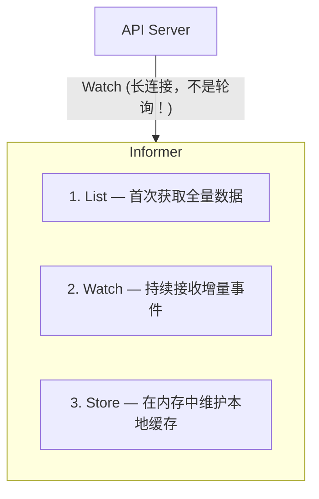
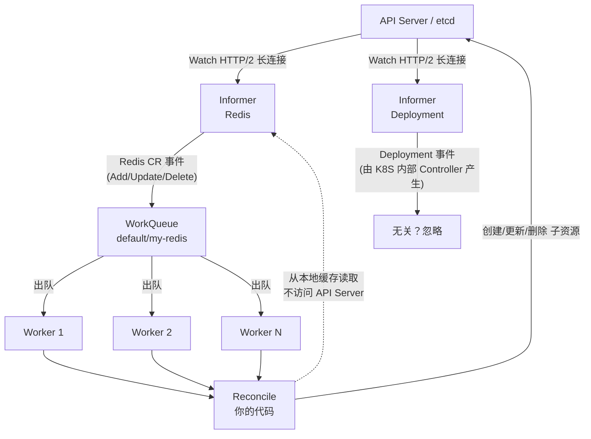

# 第 4 章：Controller 原理

本章深入 Controller 的核心机制。理解这些原理后，用 Kubebuilder 写代码会觉得"理所当然"。

## 4.1 从最简单的 Controller 说起

一个 Controller 的本质是一个死循环：

```go
// 伪代码：最简单的 Controller
func main() {
    for {
        // 1. 读取期望状态
        desired := getFromAPIServer("redis", "my-cache")

        // 2. 读取实际状态
        actual := checkRedisRunning("my-cache")

        // 3. 对比并调整
        if desired.Version != actual.Version {
            upgradeRedis("my-cache", desired.Version)
        }
        if desired.Replicas > actual.Replicas {
            addReplicas("my-cache", desired.Replicas - actual.Replicas)
        }

        // 4. 更新 status
        updateStatus(desired.Name, actual)

        time.Sleep(30 * time.Second)  // <-- 问题在这里！
    }
}
```

这个朴素的方案有几个严重问题：

1. **轮询延迟**：sleep 30 秒意味着最长 30 秒才能响应变化
2. **资源浪费**：没有任何变化时也在空转
3. **单对象处理**：如果你有 1000 个 Redis 实例，怎么办？
4. **无法水平扩展**：多个 Controller 实例如何处理？

Kubernetes 的 Controller 模式用三个机制解决了这些问题。

## 4.2 三大核心组件

### 4.2.1 Informer — 事件监听 + 本地缓存

Informer 是对 API Server 的高效封装，它做三件事：



```go
// Informer 的工作原理（伪代码）
type Informer struct {
    store    cache.Store        // 本地缓存 (index + store)
    watcher  watch.Interface    // 到 API Server 的 Watch 连接
    handlers []EventHandler     // 事件处理器
}

// 事件类型
type EventHandler struct {
    AddFunc    func(obj interface{})  // 资源被创建
    UpdateFunc func(oldObj, newObj interface{})  // 资源被修改
    DeleteFunc func(obj interface{})  // 资源被删除
}

// Informer 内部流程
func (inf *Informer) Run() {
    // 步骤 1: List — 获取全量数据填充本地缓存
    items := inf.client.List("redis")
    for _, item := range items {
        inf.store.Add(item)
    }

    // 步骤 2: Watch — 建立长连接，只接收增量变更
    events := inf.client.Watch("redis", lastResourceVersion)
    for event := range events {
        switch event.Type {
        case ADDED:
            inf.store.Add(event.Object)
            for _, h := range inf.handlers {
                h.AddFunc(event.Object)  // 触发事件处理
            }
        case MODIFIED:
            old := inf.store.Get(event.Object.Key)
            inf.store.Update(event.Object)
            for _, h := range inf.handlers {
                h.UpdateFunc(old, event.Object)
            }
        case DELETED:
            inf.store.Delete(event.Object)
            for _, h := range inf.handlers {
                h.DeleteFunc(event.Object)
            }
        }
    }
}
```

核心优势：

- **断开重连**：Watch 连接断开后，Informer 自动重连，从 `resourceVersion` 位置继续（不丢事件）
- **本地缓存**：调用 `informer.Get(key)` 不访问 API Server，极快
- **首次 List**：启动时全量同步，确保缓存完整

### 4.2.2 WorkQueue — 解耦事件与处理

Informer 直接调用事件处理器有一个问题：处理速度跟不上事件速度怎么办？如果同一个资源短时间内被多次修改怎么办？

WorkQueue 解决这些问题：

```go
// WorkQueue 的工作原理（伪代码）
type WorkQueue struct {
    queue     []string              // 待处理的对象 key
    dirty     map[string]bool       // 去重标记
    processing map[string]bool      // 正在处理中的对象
    cond      *sync.Cond            // 消费者等待条件
}

func (q *WorkQueue) Add(key string) {
    q.mu.Lock()
    defer q.mu.Unlock()

    // 如果已经在处理中，标记为 dirty（需要重新处理）
    if q.processing[key] {
        q.dirty[key] = true
        return
    }

    // 如果已经在队列中，跳过（去重）
    if q.dirty[key] {
        return
    }

    q.dirty[key] = true
    q.queue = append(q.queue, key)
    q.cond.Signal()  // 唤醒一个等待的 worker
}

func (q *WorkQueue) Get() (string, bool) {
    q.mu.Lock()
    defer q.mu.Unlock()

    for len(q.queue) == 0 {
        q.cond.Wait()  // 等待新任务
    }

    key := q.queue[0]
    q.queue = q.queue[1:]
    q.processing[key] = true
    delete(q.dirty, key)
    return key, true
}

func (q *WorkQueue) Done(key string) {
    q.mu.Lock()
    defer q.mu.Unlock()

    delete(q.processing, key)

    // 如果处理期间又被标记为 dirty，重新入队
    if q.dirty[key] {
        q.queue = append(q.queue, key)
        q.dirty[key] = false
        q.cond.Signal()
    }
}
```

这样一来：

- **去重**：同一个 key 在队列中只出现一次（在入队到出队期间，多次修改只处理一次）
- **可靠重试**：处理失败时，key 不会丢失
- **限速**：通过控制 worker 数量来限制并发

### 4.2.3 Reconcile Loop — 核心调谐逻辑

把 Informer 和 WorkQueue 串起来的就是 Reconcile Loop：

```go
// 标准的 Controller 结构
type Controller struct {
    informer  cache.Informer    // 监听资源变化
    queue     workqueue.WorkQueue  // 工作队列
    reconciler Reconciler         // 调谐逻辑
    workers   int                 // 并发 worker 数量
}

// Informer 事件 → WorkQueue
func (c *Controller) addEventHandler() {
    c.informer.AddEventHandler(cache.ResourceEventHandlerFuncs{
        AddFunc: func(obj interface{}) {
            key, _ := cache.MetaNamespaceKeyFunc(obj)
            c.queue.Add(key)
        },
        UpdateFunc: func(old, new interface{}) {
            // 只关心 spec 变化
            if old.Spec != new.Spec {
                key, _ := cache.MetaNamespaceKeyFunc(new)
                c.queue.Add(key)
            }
        },
        DeleteFunc: func(obj interface{}) {
            key, _ := cache.DeletionHandlingMetaNamespaceKeyFunc(obj)
            c.queue.Add(key)
        },
    })
}

// Reconcile 内部的逻辑（这就是你要写的部分）
func (r *RedisReconciler) Reconcile(ctx context.Context, req Request) (Result, error) {
    // 1. 从 Informer 缓存获取 CR（不访问 API Server！）
    var redis Redis
    if err := r.Get(ctx, req.NamespacedName, &redis); err != nil {
        // 如果资源已被删除，什么都不做
        return Result{}, client.IgnoreNotFound(err)
    }

    // 2. 检查 spec，确保实际状态匹配
    if redis.Spec.Replicas > 0 {
        // 检查 Deployment 是否存在
        var deploy appsv1.Deployment
        err := r.Get(ctx, req.NamespacedName, &deploy)

        if errors.IsNotFound(err) {
            // 需要创建
            deploy = r.buildDeployment(&redis)
            if err := r.Create(ctx, &deploy); err != nil {
                return Result{}, err  // 出错则重试
            }
        } else if err != nil {
            return Result{}, err
        }

        // 检查是否需要扩缩容
        if *deploy.Spec.Replicas != redis.Spec.Replicas {
            deploy.Spec.Replicas = &redis.Spec.Replicas
            if err := r.Update(ctx, &deploy); err != nil {
                return Result{}, err
            }
        }
    }

    // 3. 更新 CR 的 status
    redis.Status.Phase = "Running"
    redis.Status.Address = fmt.Sprintf("%s.%s.svc:6379", redis.Name, redis.Namespace)
    if err := r.Status().Update(ctx, &redis); err != nil {
        return Result{}, err
    }

    // 4. 返回是否需要重新排队
    return Result{}, nil
}
```

## 4.3 完整数据流图



关键路径说明：

1. **事件入队**：Informer 收到事件 → 提取 key（`namespace/name`）→ 加入 WorkQueue
2. **去重处理**：相同 key 多次入队只保留一次；正在处理的 key 会标记 dirty 以便重处理
3. **并发调谐**：多个 Worker 从 WorkQueue 取 key，调用 Reconcile（每个 key 同一时刻只被一个 worker 处理）
4. **级联效应**：Reconcile 创建的 Deployment 也可能触发事件，但那是另一个 Informer 的事

## 4.4 边缘触发 vs 水平触发

Controller 采用**边缘触发**（Edge Triggered）模式：

| 模式 | 说明 | K8S 如何实现 |
|------|------|-------------|
| 边缘触发 | 每次状态变化产生一个事件 | Informer Watch 到资源变化 → 入队一次 |
| 水平触发 | 不断检查当前状态 | **Reconcile 可以安全地多次执行，不会产生副作用** |

这就是为什么 Reconcile 函数**必须是幂等的**：同一个 key 可能被处理多次（比如 Controller 重启后），每次执行应该得到相同的结果。

```go
// ✅ 正确的 Reconcile：每次执行结果相同
func (r *RedisReconciler) Reconcile(ctx context.Context, req Request) (Result, error) {
    // 检查 Deployment 是否存在，不存在则创建
    // 如果已存在，确保配置正确
    // 这个逻辑无论执行多少次都不会出问题
}

// ❌ 错误的 Reconcile：非幂等
func (r *RedisReconciler) Reconcile(ctx context.Context, req Request) (Result, error) {
    r.counter++  // 每次执行都增加，重启后状态不一致！
}
```

## 4.5 Owner Reference — 关联与级联删除

当 Reconcile 创建子资源（如 Deployment）时，需要建立归属关系：

```go
func (r *RedisReconciler) buildDeployment(redis *cachev1.Redis) *appsv1.Deployment {
    deploy := &appsv1.Deployment{
        ObjectMeta: metav1.ObjectMeta{
            Name:      redis.Name,
            Namespace: redis.Namespace,
            OwnerReferences: []metav1.OwnerReference{
                *metav1.NewControllerRef(redis, cachev1.GroupVersion.WithKind("Redis")),
            },
        },
        // ... spec
    }

    // OwnerReference 的效果：
    // 1. 删除 Redis CR 时，K8S 自动删除关联的 Deployment
    // 2. K8S GC Controller 确保不会留下孤儿资源
}
```

## 4.6 Finalizer — 安全删除

当资源被标记删除时，如果有 Finalizer，K8S 不会立刻从 etcd 中删除它，而是在 `metadata.deletionTimestamp` 上设置时间戳。Controller 需要清理外部资源后才能移除 Finalizer。

```go
const redisFinalizer = "cache.example.com/finalizer"

func (r *RedisReconciler) Reconcile(ctx context.Context, req Request) (Result, error) {
    var redis cachev1.Redis
    if err := r.Get(ctx, req.NamespacedName, &redis); err != nil {
        return Result{}, client.IgnoreNotFound(err)
    }

    // 判断是否正在被删除
    if !redis.DeletionTimestamp.IsZero() {
        // 执行清理逻辑（备份数据、释放外部资源等）
        if err := r.cleanupExternalResources(&redis); err != nil {
            return Result{}, err
        }
        // 移除 Finalizer，让 K8S 真正删除资源
        controllerutil.RemoveFinalizer(&redis, redisFinalizer)
        return Result{}, r.Update(ctx, &redis)
    }

    // 正常创建时，添加 Finalizer
    if !controllerutil.ContainsFinalizer(&redis, redisFinalizer) {
        controllerutil.AddFinalizer(&redis, redisFinalizer)
        return Result{}, r.Update(ctx, &redis)
    }

    // 正常的 Reconcile 逻辑...
}
```

## 4.7 本章小结

| 组件 | 职责 | 关键特性 |
|------|------|---------|
| **Informer** | 监听 API Server 变化 + 本地缓存 | List + Watch、断线重连、内存索引 |
| **WorkQueue** | 事件排队与去重 | 去重、可靠重试、限速 |
| **Reconcile** | 核心业务逻辑 | 幂等、读缓存不读 API |
| **OwnerReference** | 资源归属 | 级联删除 |
| **Finalizer** | 安全删除 | 清理外部依赖 |

记住一个核心原则：**所有 Reconcile 都必须是幂等的**。

下一章，我们用 Kubebuilder 快速创建项目脚手架。
