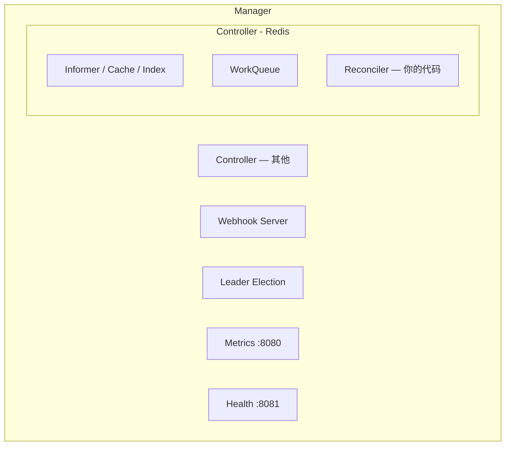

# 第 5 章：Kubebuilder 入门

第 3 章我们手写了 CRD YAML，第 4 章讲了 Controller 原理。现在我们用 Kubebuilder 框架把这一切自动化。

## 5.1 为什么用 Kubebuilder？

如果不用框架，你需要自己处理：
- CRD YAML 的生成和更新
- Informer、WorkQueue 的初始化和生命周期管理
- Leader Election（多副本选举）
- Metrics、Health Check 端点
- Webhook 的证书管理
- 代码生成（deepcopy、client、informer、lister）

Kubebuilder 把这些都封装好了，你只需要关注 Reconcile 逻辑。

## 5.2 创建项目

```bash
# 创建项目目录
mkdir -p ~/redis-operator && cd ~/redis-operator

# 初始化 Go module
go mod init github.com/YOUR_USERNAME/redis-operator

# 用 Kubebuilder 初始化项目
kubebuilder init --domain example.com --repo github.com/YOUR_USERNAME/redis-operator
```

执行后，Kubebuilder 会生成以下文件结构：

```
redis-operator/
├── cmd/
│   └── main.go              # 程序入口
├── config/
│   ├── crd/                  # CRD YAML（自动生成）
│   │   └── kustomization.yaml
│   ├── default/              # 默认 Kustomize 配置
│   │   ├── kustomization.yaml
│   │   ├── manager_auth_proxy_patch.yaml
│   │   └── manager_config_patch.yaml
│   ├── manager/              # Manager Deployment
│   │   └── manager.yaml
│   ├── rbac/                 # RBAC 配置
│   │   ├── role.yaml
│   │   └── role_binding.yaml
│   └── webhook/              # Webhook 配置
│       └── kustomization.yaml
├── Dockerfile                # 构建镜像
├── Makefile                  # 构建、测试、部署命令
├── PROJECT                   # Kubebuilder 项目元数据
├── go.mod
└── go.sum
```

## 5.3 项目结构详解

### cmd/main.go — 入口文件

```go
package main

import (
    "flag"
    "os"
    "sigs.k8s.io/controller-runtime/pkg/log/zap"
    // ... 其他 import
)

func main() {
    // 1. 解析命令行参数
    var metricsAddr string
    var enableLeaderElection bool
    var probeAddr string
    flag.StringVar(&metricsAddr, "metrics-bind-address", ":8080", "...")
    flag.StringVar(&probeAddr, "health-probe-bind-address", ":8081", "...")
    flag.BoolVar(&enableLeaderElection, "leader-elect", false, "...")
    opts := zap.Options{Development: true}
    opts.BindFlags(flag.CommandLine)
    flag.Parse()

    // 2. 创建 Manager（Controller 的"管家"）
    mgr, err := ctrl.NewManager(ctrl.GetConfigOrDie(), ctrl.Options{
        Scheme:                 scheme,
        MetricsBindAddress:     metricsAddr,
        Port:                   9443,
        HealthProbeBindAddress: probeAddr,
        LeaderElection:         enableLeaderElection,
        LeaderElectionID:       "redis-operator.example.com",
    })
    if err != nil {
        setupLog.Error(err, "unable to start manager")
        os.Exit(1)
    }

    // 3. 注册 Controller（后续章节会创建）
    // if err = (&controller.RedisReconciler{...}).SetupWithManager(mgr); err != nil {
    //     setupLog.Error(err, "unable to create controller", "controller", "Redis")
    //     os.Exit(1)
    // }

    // 4. 启动 Manager（启动所有 Informer、Controller、Webhook）
    if err := mgr.Start(ctrl.SetupSignalHandler()); err != nil {
        setupLog.Error(err, "problem running manager")
        os.Exit(1)
    }
}
```

**Manager** 是 controller-runtime 的核心。它管理：
- 所有 Controller 的生命周期
- 所有 Informer 的创建和运行
- Leader Election
- Metrics / Health Probe HTTP 服务
- Webhook Server（TLS 证书自动管理）

### Makefile — 常用命令

```makefile
# 安装 CRD 到集群
make install

# 本地运行 Controller（不部署到集群）
make run

# 构建 Docker 镜像
make docker-build IMG=redis-operator:latest

# 推送到镜像仓库
make docker-push IMG=redis-operator:latest

# 部署到集群
make deploy IMG=redis-operator:latest

# 卸载 CRD
make uninstall

# 生成代码（deepcopy、Webhook 等）
make generate

# 生成 Webhook 相关的清单文件
make manifests

# 运行测试
make test
```

## 5.4 创建 API（CRD 定义）

```bash
# 创建 API：Group=cache, Version=v1, Kind=Redis
kubebuilder create api --group cache --version v1 --kind Redis

# 交互提示：
# Create Resource [y/n] → y   (创建 CRD 相关代码)
# Create Controller [y/n] → y (创建 Controller 相关代码)
```

这条命令生成了核心的业务代码文件：

```
api/
└── v1/
    ├── groupversion_info.go   # API Group/Version 常量
    ├── redis_types.go         # Spec/Status 结构体定义 ← 你会频繁修改这个
    └── zz_generated.deepcopy.go  # DeepCopy 方法（自动生成，不要手动修改）

internal/
└── controller/
    └── redis_controller.go   # Reconcile 逻辑 ← 你在这里写业务代码
```

### groupversion_info.go

```go
// Package v1 contains API Schema definitions for the cache v1 API group
// +kubebuilder:object:generate=true
// +groupName=cache.example.com
package v1

import (
    "k8s.io/apimachinery/pkg/runtime/schema"
    "sigs.k8s.io/controller-runtime/pkg/scheme"
)

var (
    // GroupVersion is the group version used to register these objects
    GroupVersion = schema.GroupVersion{Group: "cache.example.com", Version: "v1"}

    // SchemeBuilder is used to add go types to the GroupVersionKind scheme
    SchemeBuilder = &scheme.Builder{GroupVersion: GroupVersion}

    // AddToScheme adds the types in this group-version to the given scheme.
    AddToScheme = SchemeBuilder.AddToScheme
)
```

### redis_types.go — 你需要修改的核心文件

```go
package v1

import (
    metav1 "k8s.io/apimachinery/pkg/apis/meta/v1"
)

// RedisSpec defines the desired state of Redis
type RedisSpec struct {
    // INSERT ADDITIONAL SPEC FIELDS - desired state of cluster
    // Important: Run "make" to regenerate code after modifying this file
}

// RedisStatus defines the observed state of Redis
type RedisStatus struct {
    // INSERT ADDITIONAL STATUS FIELD - define observed state of cluster
    // Important: Run "make" to regenerate code after modifying this file
}

//+kubebuilder:object:root=true
//+kubebuilder:subresource:status

// Redis is the Schema for the redis API
type Redis struct {
    metav1.TypeMeta   `json:",inline"`
    metav1.ObjectMeta `json:"metadata,omitempty"`

    Spec   RedisSpec   `json:"spec,omitempty"`
    Status RedisStatus `json:"status,omitempty"`
}

//+kubebuilder:object:root=true

// RedisList contains a list of Redis
type RedisList struct {
    metav1.TypeMeta `json:",inline"`
    metav1.ListMeta `json:"metadata,omitempty"`
    Items           []Redis `json:"items"`
}

func init() {
    SchemeBuilder.Register(&Redis{}, &RedisList{})
}
```

## 5.5 Marker 注解系统

Kubebuilder 用特殊的注释（Marker）来控制代码生成。这些注释必须紧挨在类型定义或字段定义的上方。

### 核心 Marker 速查

```go
// 类型级别 Marker
//+kubebuilder:object:root=true          // 标记为 K8S 资源（必须）
//+kubebuilder:subresource:status       // 启用 /status 子资源
//+kubebuilder:resource:scope=Cluster   // 集群级别（默认 Namespaced）
//+kubebuilder:storageversion           // 标记为存储版本

// 字段级别 Marker
//+kubebuilder:validation:Required      // 必填字段
//+kubebuilder:validation:Optional      // 可选字段
//+kubebuilder:validation:MaxLength=64  // 字符串最大长度
//+kubebuilder:validation:Minimum=1     // 数字最小值
//+kubebuilder:validation:Maximum=10    // 数字最大值
//+kubebuilder:validation:Enum=6.2;7.0;7.2  // 枚举值
//+kubebuilder:validation:Pattern=^\d+(Ki|Mi|Gi)$  // 正则
//+kubebuilder:default=1                // 默认值
//+kubebuilder:validation:XPreserveUnknownFields  // 保留未知字段

// 打印列 Marker（放在结构体上方）
//+kubebuilder:printcolumn:name="Version",type=string,JSONPath=`.spec.version`
//+kubebuilder:printcolumn:name="Phase",type=string,JSONPath=`.status.phase`
```

修改 `redis_types.go` 后，运行：

```bash
make generate    # 重新生成 zz_generated.deepcopy.go
make manifests   # 重新生成 config/crd/ 下的 YAML 文件
```

## 5.6 controller-runtime 交互模型



## 5.7 本章小结

| 命令 | 作用 |
|------|------|
| `kubebuilder init` | 创建项目脚手架 |
| `kubebuilder create api` | 创建 CRD 类型 + Controller |
| `make generate` | 重新生成 deepcopy 代码 |
| `make manifests` | 重新生成 CRD YAML |
| `make install` | 安装 CRD 到集群 |
| `make run` | 本地运行 Controller |

核心文件：
- `api/v1/redis_types.go` — 定义 Spec/Status（数据结构）
- `internal/controller/redis_controller.go` — 实现 Reconcile（业务逻辑）
- `cmd/main.go` — 启动入口（一般不需要改）

下一章，我们充实 RedisSpec 和 RedisStatus，设计一个真实的 API。
