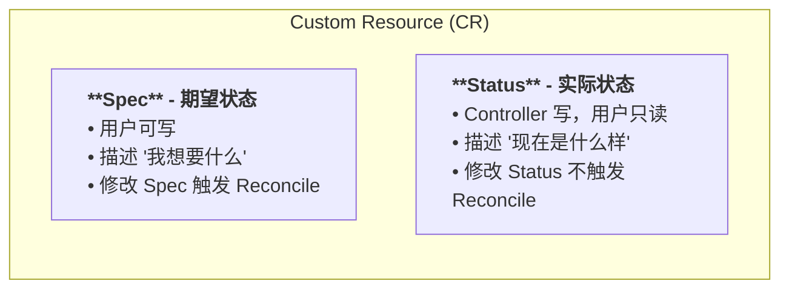

# 第 6 章：设计 API

本章我们要为 Redis Operator 设计一个生产可用的 API。好的 API 设计是 Operator 成功的一半。

## 6.1 设计原则

### 6.1.1 Spec vs Status 的职责边界



### 6.1.2 API 版本演进策略

| 阶段 | 版本名 | 特点 |
|------|--------|------|
| 实验 | `v1alpha1` | 随时可能大改，可能被删除 |
| 测试 | `v1beta1` | 基本稳定，但可能有小改 |
| 稳定 | `v1` | 保证兼容 |

```yaml
# 多版本共存
spec:
  versions:
    - name: v1alpha1
      served: true     # 仍然提供 API
      storage: false   # 但底层用 v1 存储
    - name: v1
      served: true
      storage: true    # ← 这是存储版本
```

## 6.2 定义 RedisSpec

```go
// api/v1/redis_types.go

// RedisSpec defines the desired state of Redis
type RedisSpec struct {
    // Redis 版本
    // +kubebuilder:validation:Enum=6.2;7.0;7.2
    // +kubebuilder:validation:Required
    Version string `json:"version"`

    // 副本数量（主 + 从）
    // +kubebuilder:validation:Minimum=1
    // +kubebuilder:validation:Maximum=10
    // +kubebuilder:default=1
    Replicas int32 `json:"replicas,omitempty"`

    // 每个 Pod 的内存限制
    // +kubebuilder:validation:Pattern=^\d+(Ki|Mi|Gi)$
    // +kubebuilder:default="1Gi"
    Memory string `json:"memory,omitempty"`

    // 持久化存储配置
    Persistence *PersistenceConfig `json:"persistence,omitempty"`

    // Redis 配置参数
    // +kubebuilder:default={maxmemory-policy: "allkeys-lru"}
    Config map[string]string `json:"config,omitempty"`

    // 备份配置
    Backup *BackupConfig `json:"backup,omitempty"`

    // 镜像拉取策略
    // +kubebuilder:default=IfNotPresent
    ImagePullPolicy corev1.PullPolicy `json:"imagePullPolicy,omitempty"`

    // Pod 亲和性配置
    Affinity *corev1.Affinity `json:"affinity,omitempty"`
}

// PersistenceConfig 持久化存储配置
type PersistenceConfig struct {
    // 是否启用持久化
    // +kubebuilder:default=true
    Enabled bool `json:"enabled,omitempty"`

    // 存储大小
    // +kubebuilder:default="10Gi"
    Size string `json:"size,omitempty"`

    // 存储类名称
    StorageClass *string `json:"storageClass,omitempty"`
}

// BackupConfig 备份配置
type BackupConfig struct {
    // 备份计划（cron 表达式）
    // +kubebuilder:default="0 2 * * *"
    Schedule string `json:"schedule,omitempty"`

    // 备份保留天数
    // +kubebuilder:default=7
    RetentionDays int32 `json:"retentionDays,omitempty"`

    // 备份目标（S3 bucket URL）
    Destination string `json:"destination,omitempty"`
}
```

## 6.3 定义 RedisStatus

```go
// RedisStatus defines the observed state of Redis
type RedisStatus struct {
    // 阶段：Pending → Creating → Running → Failed
    // +kubebuilder:default=Pending
    Phase RedisPhase `json:"phase,omitempty"`

    // 连接地址（用户用来连 Redis 的地址）
    Address string `json:"address,omitempty"`

    // 各副本的状态
    Nodes []RedisNodeStatus `json:"nodes,omitempty"`

    // 最后备份时间
    LastBackupTime *metav1.Time `json:"lastBackupTime,omitempty"`

    // Conditions（更结构化的状态）
    Conditions []metav1.Condition `json:"conditions,omitempty"`
}

// RedisPhase 是 Redis 实例生命周期的阶段
// +kubebuilder:validation:Enum=Pending;Creating;Running;Failed;Updating
type RedisPhase string

const (
    RedisPending  RedisPhase = "Pending"
    RedisCreating RedisPhase = "Creating"
    RedisRunning  RedisPhase = "Running"
    RedisFailed   RedisPhase = "Failed"
    RedisUpdating RedisPhase = "Updating"
)

// RedisNodeStatus 表示单个 Redis 节点的状态
type RedisNodeStatus struct {
    // 节点名称
    Name string `json:"name"`

    // 角色：master 或 slave
    // +kubebuilder:validation:Enum=master;slave
    Role string `json:"role"`

    // 节点 IP
    IP string `json:"ip,omitempty"`

    // 节点是否健康
    Healthy bool `json:"healthy"`
}
```

## 6.4 Conditions — 标准化的状态表达

Kubernetes 的 Conditions 是一种标准化的状态报告方式，比简单的 `Phase` 字段信息量更大：

```go
// 在 meta/v1 中
type Condition struct {
    Type               string             // 条件类型
    Status             ConditionStatus    // True/False/Unknown
    ObservedGeneration int64              // 基于哪一代 Spec 的判断
    LastTransitionTime Time               // 最后切换时间
    Reason             string             // 机器可读的原因
    Message            string             // 人类可读的描述
}
```

在 Controller 中设置 Conditions：

```go
import (
    metav1 "k8s.io/apimachinery/pkg/apis/meta/v1"
)

// 定义 Condition 类型
const (
    ConditionAvailable  = "Available"
    ConditionReplicasReady = "ReplicasReady"
    ConditionBackupReady   = "BackupReady"
)

// 设置 Condition 的辅助函数
func setCondition(redis *cachev1.Redis, condType string, status metav1.ConditionStatus, reason, message string) {
    newCondition := metav1.Condition{
        Type:               condType,
        Status:             status,
        LastTransitionTime: metav1.Now(),
        Reason:             reason,
        Message:            message,
    }

    // 查找或替换
    for i, c := range redis.Status.Conditions {
        if c.Type == condType {
            if c.Status != status {
                redis.Status.Conditions[i] = newCondition
            }
            return
        }
    }
    redis.Status.Conditions = append(redis.Status.Conditions, newCondition)
}

// 使用示例
setCondition(&redis, ConditionAvailable, metav1.ConditionTrue,
    "RedisReady", "Redis instance is ready to accept connections")
```

效果：

```yaml
status:
  conditions:
  - type: Available
    status: "True"
    reason: RedisReady
    message: "Redis instance is ready to accept connections"
    lastTransitionTime: "2024-01-15T10:30:00Z"
  - type: ReplicasReady
    status: "True"
    reason: AllReplicasRunning
    message: "All 3 replicas are running"
```

## 6.5 完整的 redis_types.go

```go
package v1

import (
    corev1 "k8s.io/api/core/v1"
    metav1 "k8s.io/apimachinery/pkg/apis/meta/v1"
)

// +kubebuilder:object:root=true
// +kubebuilder:subresource:status
// +kubebuilder:printcolumn:name="Version",type=string,JSONPath=`.spec.version`
// +kubebuilder:printcolumn:name="Replicas",type=integer,JSONPath=`.spec.replicas`
// +kubebuilder:printcolumn:name="Phase",type=string,JSONPath=`.status.phase`
// +kubebuilder:printcolumn:name="Address",type=string,JSONPath=`.status.address`
// +kubebuilder:printcolumn:name="Age",type=date,JSONPath=`.metadata.creationTimestamp`
// +kubebuilder:resource:shortName=rs

// Redis is the Schema for the redis API
type Redis struct {
    metav1.TypeMeta   `json:",inline"`
    metav1.ObjectMeta `json:"metadata,omitempty"`

    Spec   RedisSpec   `json:"spec,omitempty"`
    Status RedisStatus `json:"status,omitempty"`
}

// RedisSpec ...
type RedisSpec struct {
    // +kubebuilder:validation:Enum=6.2;7.0;7.2
    // +kubebuilder:validation:Required
    Version string `json:"version"`

    // +kubebuilder:validation:Minimum=1
    // +kubebuilder:validation:Maximum=10
    // +kubebuilder:default=1
    Replicas int32 `json:"replicas,omitempty"`

    // +kubebuilder:validation:Pattern=^\d+(Ki|Mi|Gi)$
    // +kubebuilder:default="1Gi"
    Memory string `json:"memory,omitempty"`

    Persistence    *PersistenceConfig  `json:"persistence,omitempty"`
    // +kubebuilder:default={maxmemory-policy: "allkeys-lru"}
    Config         map[string]string   `json:"config,omitempty"`
    Backup         *BackupConfig       `json:"backup,omitempty"`
    // +kubebuilder:default=IfNotPresent
    ImagePullPolicy corev1.PullPolicy  `json:"imagePullPolicy,omitempty"`
    Affinity       *corev1.Affinity    `json:"affinity,omitempty"`
}

// RedisStatus ...
type RedisStatus struct {
    // +kubebuilder:default=Pending
    Phase          RedisPhase          `json:"phase,omitempty"`
    Address        string              `json:"address,omitempty"`
    Nodes          []RedisNodeStatus   `json:"nodes,omitempty"`
    LastBackupTime *metav1.Time        `json:"lastBackupTime,omitempty"`
    Conditions     []metav1.Condition  `json:"conditions,omitempty"`
}

type PersistenceConfig struct {
    // +kubebuilder:default=true
    Enabled      bool    `json:"enabled,omitempty"`
    // +kubebuilder:default="10Gi"
    Size         string  `json:"size,omitempty"`
    StorageClass *string `json:"storageClass,omitempty"`
}

type BackupConfig struct {
    // +kubebuilder:default="0 2 * * *"
    Schedule      string `json:"schedule,omitempty"`
    // +kubebuilder:default=7
    RetentionDays int32  `json:"retentionDays,omitempty"`
    Destination   string `json:"destination,omitempty"`
}

// +kubebuilder:validation:Enum=Pending;Creating;Running;Failed;Updating
type RedisPhase string

const (
    RedisPending  RedisPhase = "Pending"
    RedisCreating RedisPhase = "Creating"
    RedisRunning  RedisPhase = "Running"
    RedisFailed   RedisPhase = "Failed"
    RedisUpdating RedisPhase = "Updating"
)

type RedisNodeStatus struct {
    Name    string `json:"name"`
    // +kubebuilder:validation:Enum=master;slave
    Role    string `json:"role"`
    IP      string `json:"ip,omitempty"`
    Healthy bool   `json:"healthy"`
}

// +kubebuilder:object:root=true
type RedisList struct {
    metav1.TypeMeta `json:",inline"`
    metav1.ListMeta `json:"metadata,omitempty"`
    Items           []Redis `json:"items"`
}

func init() {
    SchemeBuilder.Register(&Redis{}, &RedisList{})
}
```

## 6.6 生成代码和清单

```bash
# 生成 DeepCopy 方法
make generate

# 生成 CRD YAML（输出到 config/crd/）
make manifests

# 检查生成的 CRD YAML
cat config/crd/bases/cache.example.com_redis.yaml
```

执行 `make manifests` 后，Kubebuilder 将所有 Marker 注解转换为 OpenAPI v3 Schema，写入 CRD YAML 文件。

## 6.7 安装 CRD 并测试

```bash
# 安装 CRD 到集群
make install

# 验证 CRD 已注册
kubectl get crd redis.cache.example.com

# 创建测试 CR
kubectl apply -f - <<EOF
apiVersion: cache.example.com/v1
kind: Redis
metadata:
  name: test-redis
spec:
  version: "7.0"
  replicas: 3
  memory: "2Gi"
  persistence:
    enabled: true
    size: "20Gi"
    storageClass: standard
  config:
    maxmemory-policy: "allkeys-lru"
    timeout: "300"
  backup:
    schedule: "0 2 * * *"
    retentionDays: 7
    destination: "s3://my-backups/redis/"
EOF

# 查看创建的 CR
kubectl get redis
# NAME         VERSION   REPLICAS   PHASE      ADDRESS   AGE
# test-redis   7.0       3                                 5s

# 查看完整的 YAML（注意 status 字段被自动初始化了）
kubectl get redis test-redis -o yaml
```

## 6.8 本章小结

好的 API 设计要点：

1. **Spec 是用户的期望**，只包含用户可以决定的配置
2. **Status 是系统的汇报**，包含运行时信息和使用建议
3. **使用 Marker 做校验**，在 API 层面就拒绝无效输入
4. **使用 Conditions 而不是简单的 Phase**，提供更丰富的状态信息
5. **用正确的 Go 类型**（`*string` 表示可选的字符串，`int32` 不是 `int`）

下一章，我们实现 Reconcile 逻辑，让 Operator 真正工作起来。
