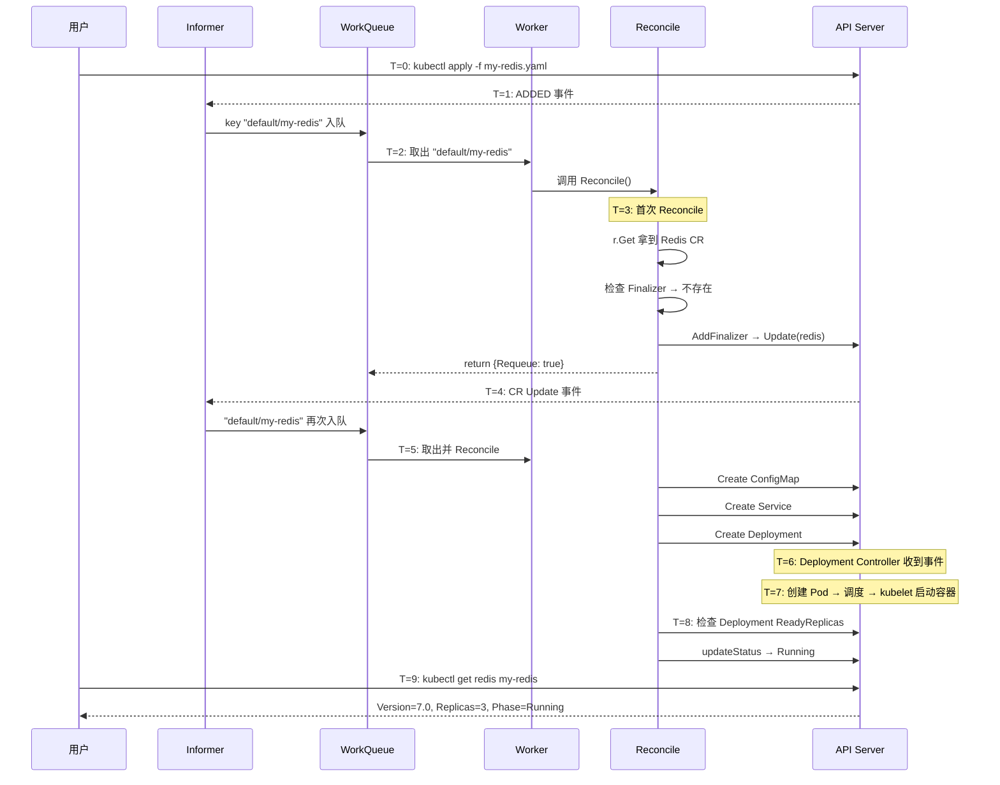
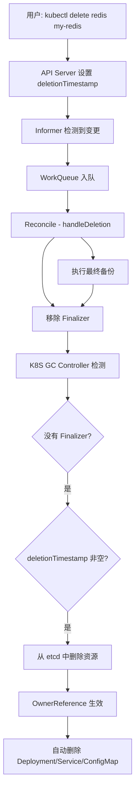

# 第 7 章：实现 Controller

本章是教程的核心 — 编写真正的 Reconcile 逻辑，让 Operator 管理 Redis 实例。

## 7.1 Controller 骨架

Kubebuilder 生成的 `redis_controller.go` 长这样：

```go
// internal/controller/redis_controller.go
package controller

import (
    "context"
    "fmt"

    appsv1 "k8s.io/api/apps/v1"
    corev1 "k8s.io/api/core/v1"
    "k8s.io/apimachinery/pkg/api/errors"
    metav1 "k8s.io/apimachinery/pkg/apis/meta/v1"
    "k8s.io/apimachinery/pkg/runtime"
    "k8s.io/apimachinery/pkg/types"
    ctrl "sigs.k8s.io/controller-runtime"
    "sigs.k8s.io/controller-runtime/pkg/client"
    "sigs.k8s.io/controller-runtime/pkg/controller/controllerutil"
    "sigs.k8s.io/controller-runtime/pkg/log"

    cachev1 "github.com/YOUR_USERNAME/redis-operator/api/v1"
)

// RedisReconciler reconciles a Redis object
type RedisReconciler struct {
    client.Client  // 嵌入 Client，用于读写 K8S 资源
    Scheme *runtime.Scheme  // 类型注册表
}

// +kubebuilder:rbac:groups=cache.example.com,resources=redis,verbs=get;list;watch;create;update;patch;delete
// +kubebuilder:rbac:groups=cache.example.com,resources=redis/status,verbs=get;update;patch
// +kubebuilder:rbac:groups=apps,resources=deployments,verbs=get;list;watch;create;update;patch;delete
// +kubebuilder:rbac:groups=core,resources=services,verbs=get;list;watch;create;update;patch;delete
// +kubebuilder:rbac:groups=core,resources=configmaps,verbs=get;list;watch;create;update;patch;delete

// Reconcile 是 Controller 的核心方法
func (r *RedisReconciler) Reconcile(ctx context.Context, req ctrl.Request) (ctrl.Result, error) {
    logger := log.FromContext(ctx)

    // --- 1. 获取 Redis CR ---
    var redis cachev1.Redis
    if err := r.Get(ctx, req.NamespacedName, &redis); err != nil {
        // CR 被删除了，不需要处理
        return ctrl.Result{}, client.IgnoreNotFound(err)
    }

    // --- 2. 处理删除 ---
    if !redis.DeletionTimestamp.IsZero() {
        return r.handleDeletion(ctx, &redis)
    }

    // --- 3. 添加 Finalizer ---
    if !controllerutil.ContainsFinalizer(&redis, redisFinalizer) {
        controllerutil.AddFinalizer(&redis, redisFinalizer)
        if err := r.Update(ctx, &redis); err != nil {
            return ctrl.Result{}, err
        }
    }

    // --- 4. 调谐子资源 ---
    result, err := r.reconcileResources(ctx, &redis)
    if err != nil {
        logger.Error(err, "Reconcile failed")
        return result, err
    }

    logger.Info("Reconcile completed successfully",
        "redis", redis.Name,
        "phase", redis.Status.Phase)
    return result, nil
}

// SetupWithManager 将 Controller 注册到 Manager
func (r *RedisReconciler) SetupWithManager(mgr ctrl.Manager) error {
    return ctrl.NewControllerManagedBy(mgr).
        For(&cachev1.Redis{}).        // 监听 Redis CR
        Owns(&appsv1.Deployment{}).   // 也监听我们创建的 Deployment
        Owns(&corev1.Service{}).      // 也监听我们创建的 Service
        Complete(r)
}
```

## 7.2 RBAC Marker 详解

```go
// +kubebuilder:rbac:groups=cache.example.com,resources=redis,verbs=get;list;watch;create;update;patch;delete
// +kubebuilder:rbac:groups=cache.example.com,resources=redis/status,verbs=get;update;patch
// +kubebuilder:rbac:groups=apps,resources=deployments,verbs=get;list;watch;create;update;patch;delete
// +kubebuilder:rbac:groups=core,resources=services,verbs=get;list;watch;create;update;patch;delete
```

这些注释在 `make manifests` 时会自动生成 `config/rbac/role.yaml`。分组说明：

| RBAC Marker | 原因 |
|-------------|------|
| `redis` | Reconcile 需要读取和更新 CR 本身 |
| `redis/status` | 更新 status 字段需要专门的权限 |
| `deployments` | 我们需要创建和管理 Redis 的 Deployment |
| `services` | 需要暴露 Redis 服务 |
| `configmaps` | 存放 Redis 配置文件 |

## 7.3 实现 reconcileResources

```go
const redisFinalizer = "cache.example.com/finalizer"

func (r *RedisReconciler) reconcileResources(ctx context.Context, redis *cachev1.Redis) (ctrl.Result, error) {
    logger := log.FromContext(ctx)

    // 步骤 1: 确保 ConfigMap 存在（Redis 配置文件）
    if err := r.reconcileConfigMap(ctx, redis); err != nil {
        r.updateStatus(ctx, redis, cachev1.RedisFailed, "ConfigMap creation failed")
        return ctrl.Result{}, err
    }

    // 步骤 2: 确保 Service 存在
    if err := r.reconcileService(ctx, redis); err != nil {
        r.updateStatus(ctx, redis, cachev1.RedisFailed, "Service creation failed")
        return ctrl.Result{}, err
    }

    // 步骤 3: 确保 Deployment 存在
    if err := r.reconcileDeployment(ctx, redis); err != nil {
        r.updateStatus(ctx, redis, cachev1.RedisFailed, "Deployment creation failed")
        return ctrl.Result{}, err
    }

    // 步骤 4: 收集节点状态
    if err := r.collectNodeStatus(ctx, redis); err != nil {
        return ctrl.Result{}, err
    }

    // 步骤 5: 所有资源就绪
    r.updateStatus(ctx, redis, cachev1.RedisRunning, "")
    return ctrl.Result{}, nil
}
```

## 7.4 实现各子资源管理

### 7.4.1 ConfigMap — Redis 配置文件

```go
func (r *RedisReconciler) reconcileConfigMap(ctx context.Context, redis *cachev1.Redis) error {
    logger := log.FromContext(ctx)

    // 构建期望的 ConfigMap
    cm := &corev1.ConfigMap{
        ObjectMeta: metav1.ObjectMeta{
            Name:      redis.Name + "-config",
            Namespace: redis.Namespace,
        },
    }

    // CreateOrUpdate: 不存在则创建，存在则更新
    _, err := controllerutil.CreateOrUpdate(ctx, r.Client, cm, func() error {
        // SetControllerReference 设置 OwnerReference
        if err := controllerutil.SetControllerReference(redis, cm, r.Scheme); err != nil {
            return err
        }

        // 生成 Redis 配置
        cm.Data = map[string]string{
            "redis.conf": r.buildRedisConfig(redis),
        }
        return nil
    })

    if err != nil {
        logger.Error(err, "Failed to reconcile ConfigMap")
    }
    return err
}

// buildRedisConfig 将 Spec 转换为 Redis 配置文件内容
func (r *RedisReconciler) buildRedisConfig(redis *cachev1.Redis) string {
    config := fmt.Sprintf(`
# Generated by Redis Operator
port 6379
bind 0.0.0.0
maxmemory %s
`, redis.Spec.Memory)

    for k, v := range redis.Spec.Config {
        config += fmt.Sprintf("%s %s\n", k, v)
    }

    // 持久化配置
    if redis.Spec.Persistence != nil && redis.Spec.Persistence.Enabled {
        config += `
appendonly yes
save 900 1
save 300 10
save 60 10000
`
    }
    return config
}
```

### 7.4.2 Service

```go
func (r *RedisReconciler) reconcileService(ctx context.Context, redis *cachev1.Redis) error {
    logger := log.FromContext(ctx)

    svc := &corev1.Service{
        ObjectMeta: metav1.ObjectMeta{
            Name:      redis.Name,
            Namespace: redis.Namespace,
        },
    }

    _, err := controllerutil.CreateOrUpdate(ctx, r.Client, svc, func() error {
        if err := controllerutil.SetControllerReference(redis, svc, r.Scheme); err != nil {
            return err
        }

        // 确保 Service 的 spec 是我们的期望值
        svc.Spec.Selector = map[string]string{
            "app":      "redis",
            "instance": redis.Name,
        }
        svc.Spec.Ports = []corev1.ServicePort{
            {
                Name:     "redis",
                Port:     6379,
                Protocol: corev1.ProtocolTCP,
            },
        }
        svc.Spec.Type = corev1.ServiceTypeClusterIP
        return nil
    })

    if err != nil {
        logger.Error(err, "Failed to reconcile Service")
        return err
    }

    // 更新 CR 的 Address 字段
    redis.Status.Address = fmt.Sprintf("%s.%s.svc:6379", svc.Name, svc.Namespace)
    return r.Status().Update(ctx, redis)
}
```

### 7.4.3 Deployment

```go
func (r *RedisReconciler) reconcileDeployment(ctx context.Context, redis *cachev1.Redis) error {
    logger := log.FromContext(ctx)

    deploy := &appsv1.Deployment{
        ObjectMeta: metav1.ObjectMeta{
            Name:      redis.Name,
            Namespace: redis.Namespace,
        },
    }

    _, err := controllerutil.CreateOrUpdate(ctx, r.Client, deploy, func() error {
        if err := controllerutil.SetControllerReference(redis, deploy, r.Scheme); err != nil {
            return err
        }

        // 标签
        labels := map[string]string{
            "app":       "redis",
            "instance":  redis.Name,
            "version":   redis.Spec.Version,
        }

        // 确保 Deployment 的 spec 匹配
        deploy.Spec.Selector = &metav1.LabelSelector{
            MatchLabels: labels,
        }
        deploy.Spec.Replicas = &redis.Spec.Replicas

        // Pod 模板
        deploy.Spec.Template = corev1.PodTemplateSpec{
            ObjectMeta: metav1.ObjectMeta{
                Labels: labels,
            },
            Spec: corev1.PodSpec{
                Containers: []corev1.Container{
                    {
                        Name:  "redis",
                        Image: fmt.Sprintf("redis:%s", redis.Spec.Version),
                        Ports: []corev1.ContainerPort{
                            {ContainerPort: 6379, Name: "redis"},
                        },
                        Resources: corev1.ResourceRequirements{
                            Requests: corev1.ResourceList{
                                corev1.ResourceMemory: resource.MustParse(redis.Spec.Memory),
                            },
                            Limits: corev1.ResourceList{
                                corev1.ResourceMemory: resource.MustParse(redis.Spec.Memory),
                            },
                        },
                        VolumeMounts: []corev1.VolumeMount{
                            {
                                Name:      "config",
                                MountPath: "/usr/local/etc/redis/redis.conf",
                                SubPath:   "redis.conf",
                            },
                        },
                    },
                },
                Volumes: []corev1.Volume{
                    {
                        Name: "config",
                        VolumeSource: corev1.VolumeSource{
                            ConfigMap: &corev1.ConfigMapVolumeSource{
                                LocalObjectReference: corev1.LocalObjectReference{
                                    Name: redis.Name + "-config",
                                },
                            },
                        },
                    },
                },
            },
        }

        // 持久化存储
        if redis.Spec.Persistence != nil && redis.Spec.Persistence.Enabled {
            deploy.Spec.Template.Spec.Volumes = append(
                deploy.Spec.Template.Spec.Volumes,
                corev1.Volume{
                    Name: "data",
                    VolumeSource: corev1.VolumeSource{
                        PersistentVolumeClaim: &corev1.PersistentVolumeClaimVolumeSource{
                            ClaimName: redis.Name + "-data",
                        },
                    },
                },
            )
        }

        return nil
    })

    if err != nil {
        logger.Error(err, "Failed to reconcile Deployment")
    }
    return err
}
```

## 7.5 Controller 三大核心模式

### 模式 1: `CreateOrUpdate` — 声明式管理子资源

```go
_, err := controllerutil.CreateOrUpdate(ctx, r.Client, obj, func() error {
    // 1. 设置 OwnerReference（让 K8S 知道这个资源的"主人"是谁）
    if err := controllerutil.SetControllerReference(owner, obj, r.Scheme); err != nil {
        return err
    }

    // 2. 设置 Spec（describe desired state）
    obj.Spec = desiredSpec

    return nil
})
```

这个函数做了三件事：
- **不存在** → 调用 `r.Create(ctx, obj)` 创建
- **存在但 spec 不同** → 调用 `r.Update(ctx, obj)` 更新
- **存在且匹配** → 什么都不做

### 模式 2: 观察子资源变化 → 重新 Reconcile

```go
func (r *RedisReconciler) SetupWithManager(mgr ctrl.Manager) error {
    return ctrl.NewControllerManagedBy(mgr).
        For(&cachev1.Redis{}).           // 监听 Redis CR
        Owns(&appsv1.Deployment{}).      // 监听我们拥有的 Deployment
        Owns(&corev1.Service{}).         // 监听我们拥有的 Service
        Complete(r)
}
```

`Owns()` 的作用：当 Controller 创建的 Deployment 被外部修改或删除时，Controller 会自动把关联的 Redis CR 的 key 加入 WorkQueue，触发一次 Reconcile。

### 模式 3: 幂等性 — 安全地多次执行

```go
// ✅ 幂等的写法：每次都设置相同的值，多次调用效果相同
deploy.Spec.Replicas = &redis.Spec.Replicas

// ❌ 非幂等的写法：每次增加一个副本
deploy.Spec.Replicas = ptr.To(*deploy.Spec.Replicas + 1)
```

## 7.6 完整流程示例

创建 `Redis/my-redis` 后的完整执行流程：



## 7.7 处理删除

```go
func (r *RedisReconciler) handleDeletion(ctx context.Context, redis *cachev1.Redis) (ctrl.Result, error) {
    logger := log.FromContext(ctx)

    // 检查 Finalizer 是否存在
    if !controllerutil.ContainsFinalizer(redis, redisFinalizer) {
        // 已经是第二次 Reconcile，Finalizer 已移除，可以真正删除
        return ctrl.Result{}, nil
    }

    // 执行清理逻辑
    logger.Info("Cleaning up Redis instance", "redis", redis.Name)

    // 例如：做最终备份
    if redis.Spec.Backup != nil && redis.Spec.Backup.Destination != "" {
        if err := r.performFinalBackup(ctx, redis); err != nil {
            logger.Error(err, "Final backup failed, will retry")
            return ctrl.Result{}, err  // 重试
        }
    }

    // 移除 Finalizer
    controllerutil.RemoveFinalizer(redis, redisFinalizer)
    if err := r.Update(ctx, redis); err != nil {
        return ctrl.Result{}, err
    }

    // Finalizer 移除后，K8S GC 会清理剩余资源
    logger.Info("Finalizer removed, resource will be deleted")
    return ctrl.Result{}, nil
}
```

删除流程：



## 7.8 本章小结

Controller 实现的要点：

1. **使用 `controllerutil.CreateOrUpdate`** 管理子资源（声明式，幂等）
2. **使用 `Owns()`** 监听子资源变化，自动触发 Reconcile
3. **设置 `OwnerReference`** 实现级联删除
4. **使用 Finalizer** 安全地处理删除前的清理
5. **所有 Reconcile 操作都是幂等的** — 多次执行结果相同

下一章，我们添加 Webhook 做更高级的验证。
