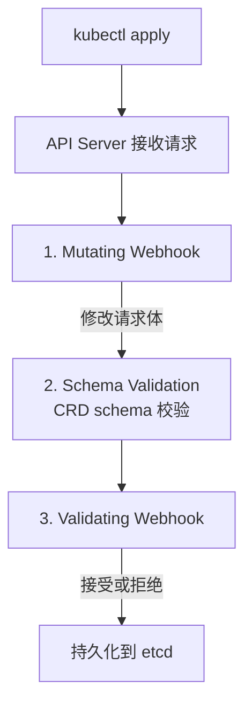
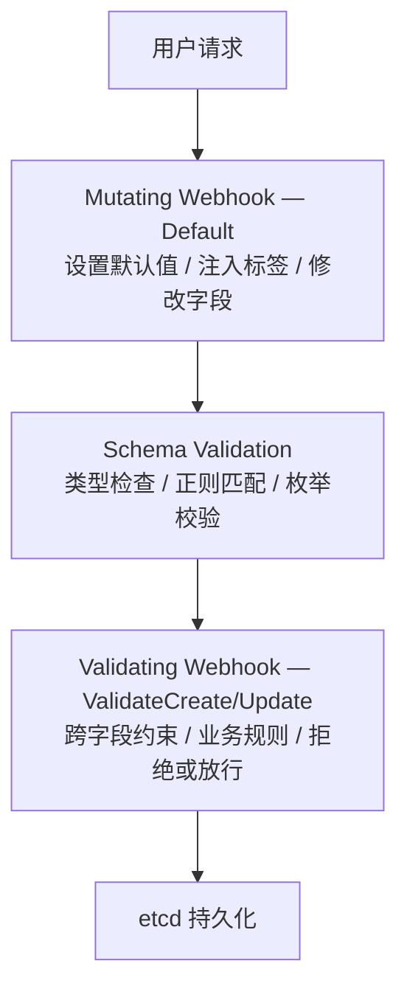

# 第 8 章：Webhook 验证与默认值

CRD Schema 的校验能力是有限的（正则、枚举、范围）。当需要更复杂的校验逻辑（比如检查两个字段的组合约束），或者想在创建资源时设置默认值，就需要 Webhook。

## 8.1 两种 Webhook

| 类型 | 执行时机 | 典型用途 |
|------|---------|---------|
| **Mutating** | 校验之前，持久化之前 | 设置默认值、注入 sidecar、修改字段 |
| **Validating** | Mutating 之后，持久化之前 | 拒绝不合规的请求、跨字段校验 |

执行顺序：



## 8.2 创建 Webhook

### 创建脚手架

```bash
# 为 Redis 类型创建 Webhook
kubebuilder create webhook --group cache --version v1 --kind Redis \
    --defaulting \      # Mutating Webhook（设置默认值）
    --programmatic-validation  # Validating Webhook（校验逻辑）
```

生成的文件：

```
api/v1/
├── redis_types.go
├── redis_webhook.go     # ← 新增：Webhook 逻辑
└── redis_webhook_test.go # ← 新增：Webhook 测试
```

### 生成 Webhook 清单

```bash
# 生成 Webhook 的 K8S 清单文件
make manifests

# 这会生成：
# config/webhook/manifests.yaml     # Webhook 配置
# config/crd/patches/webhook_in_redis.yaml  # 嵌入 CRD 的 Webhook 定义
# config/crd/patches/cainjection_in_redis.yaml  # CA 注入（cert-manager）
```

Webhook 的 TLS 证书由 cert-manager 自动管理（第 2 章已安装）。

## 8.3 实现 Defaulting Webhook（设置默认值）

```go
// api/v1/redis_webhook.go

package v1

import (
    "k8s.io/apimachinery/pkg/runtime"
    ctrl "sigs.k8s.io/controller-runtime"
    logf "sigs.k8s.io/controller-runtime/pkg/log"
    "sigs.k8s.io/controller-runtime/pkg/webhook"
    "sigs.k8s.io/controller-runtime/pkg/webhook/admission"
)

var redisLogger = logf.Log.WithName("redis-webhook")

// 确保 Redis 实现了 webhook.Defaulter 接口
var _ webhook.Defaulter = &Redis{}

// Default 在创建或更新 CR 时被调用
func (r *Redis) Default() {
    redisLogger.Info("defaulting", "name", r.Name)

    // 设置默认副本数
    if r.Spec.Replicas == 0 {
        r.Spec.Replicas = 1
    }

    // 设置默认内存
    if r.Spec.Memory == "" {
        r.Spec.Memory = "1Gi"
    }

    // 设置默认持久化配置
    if r.Spec.Persistence == nil {
        r.Spec.Persistence = &PersistenceConfig{
            Enabled: true,
            Size:    "10Gi",
        }
    }

    // 设置默认配置参数
    if r.Spec.Config == nil {
        r.Spec.Config = map[string]string{
            "maxmemory-policy": "allkeys-lru",
            "save":             "900 1 300 10 60 10000",
        }
    }

    // 设置标签
    labels := r.GetLabels()
    if labels == nil {
        labels = make(map[string]string)
    }
    if _, ok := labels["app.kubernetes.io/managed-by"]; !ok {
        labels["app.kubernetes.io/managed-by"] = "redis-operator"
    }
    r.SetLabels(labels)
}

// 注意：初始化时注册 Webhook
func (r *Redis) SetupWebhookWithManager(mgr ctrl.Manager) error {
    return ctrl.NewWebhookManagedBy(mgr).
        For(r).
        Complete()
}
```

效果：

```bash
# 用户创建一个不完整的 CR
kubectl apply -f - <<EOF
apiVersion: cache.example.com/v1
kind: Redis
metadata:
  name: test
spec:
  version: "7.0"
  # replicas、memory、persistence 都没填
EOF

# Mutating Webhook 自动补全后，实际存储到 etcd 的内容：
kubectl get redis test -o yaml
# spec:
#   version: "7.0"
#   replicas: 1          ← 自动填的
#   memory: "1Gi"        ← 自动填的
#   persistence:         ← 自动填的
#     enabled: true
#     size: "10Gi"
#   config:              ← 自动填的
#     maxmemory-policy: "allkeys-lru"
```

## 8.4 实现 Validating Webhook（校验逻辑）

```go
// 确保 Redis 实现了 webhook.Validator 接口
var _ webhook.Validator = &Redis{}

// ValidateCreate 在创建 CR 时被调用
func (r *Redis) ValidateCreate() (admission.Warnings, error) {
    redisLogger.Info("validating create", "name", r.Name)
    return nil, r.validate()
}

// ValidateUpdate 在更新 CR 时被调用
func (r *Redis) ValidateUpdate(old runtime.Object) (admission.Warnings, error) {
    redisLogger.Info("validating update", "name", r.Name)
    oldRedis := old.(*Redis)

    // 额外的更新检查：不允许降级
    if r.Spec.Version < oldRedis.Spec.Version {
        return nil, fmt.Errorf(
            "version downgrade is not allowed: from %s to %s",
            oldRedis.Spec.Version, r.Spec.Version)
    }

    // 不允许将副本缩为 0
    if r.Spec.Replicas == 0 {
        return nil, fmt.Errorf("replicas cannot be set to 0")
    }

    return nil, r.validate()
}

// ValidateDelete 在删除 CR 时被调用
func (r *Redis) ValidateDelete() (admission.Warnings, error) {
    redisLogger.Info("validating delete", "name", r.Name)
    // 通常不需要校验删除操作
    return nil, nil
}

// validate 是共用的校验逻辑
func (r *Redis) validate() error {
    var errs field.ErrorList

    // 1. 版本检查
    if r.Spec.Version == "" {
        errs = append(errs, field.Required(
            field.NewPath("spec", "version"),
            "version is required"))
    }

    // 2. 持久化 + 备份必须同时配置
    if r.Spec.Backup != nil && r.Spec.Backup.Destination != "" {
        if r.Spec.Persistence == nil || !r.Spec.Persistence.Enabled {
            errs = append(errs, field.Invalid(
                field.NewPath("spec", "backup"),
                r.Spec.Backup,
                "persistence must be enabled when backup is configured"))
        }
    }

    // 3. 备份目标必须是 S3 URL
    if r.Spec.Backup != nil && r.Spec.Backup.Destination != "" {
        if !strings.HasPrefix(r.Spec.Backup.Destination, "s3://") {
            errs = append(errs, field.Invalid(
                field.NewPath("spec", "backup", "destination"),
                r.Spec.Backup.Destination,
                "backup destination must start with s3://"))
        }
    }

    // 4. 内存格式校验
    if r.Spec.Memory != "" {
        if _, err := resource.ParseQuantity(r.Spec.Memory); err != nil {
            errs = append(errs, field.Invalid(
                field.NewPath("spec", "memory"),
                r.Spec.Memory,
                "invalid memory format, use like 2Gi, 512Mi"))
        }
    }

    // 5. 高可用性检查：生产环境至少 3 个副本
    if r.Spec.Replicas < 3 && r.Spec.Persistence != nil && r.Spec.Persistence.Enabled {
        errs = append(errs, field.Invalid(
            field.NewPath("spec", "replicas"),
            r.Spec.Replicas,
            "production use requires at least 3 replicas when persistence is enabled"))
    }

    if len(errs) > 0 {
        return apierrors.NewInvalid(
            schema.GroupKind{Group: "cache.example.com", Kind: "Redis"},
            r.Name, errs)
    }
    return nil
}
```

效果：

```bash
# 创建配置不合理的 CR
kubectl apply -f - <<EOF
apiVersion: cache.example.com/v1
kind: Redis
metadata:
  name: test
spec:
  version: "7.0"
  replicas: 1
  persistence:
    enabled: true     # 持久化启用，但只有 1 个副本
EOF

# 返回错误：
# Error from server: error when creating "test":
# admission webhook "vredis.kb.io" denied the request:
# Redis.cache.example.com "test" is invalid:
# spec.replicas: Invalid value: 1: production use requires at least 3 replicas

# 尝试版本降级
kubectl patch redis test --type=merge -p '{"spec":{"version":"6.2"}}'

# 返回错误：
# spec.version: Forbidden: version downgrade is not allowed: from 7.0 to 6.2
```

## 8.5 在 main.go 中注册 Webhook

```go
// cmd/main.go

func main() {
    // ... Manager 创建 ...

    // 注册 Controller
    if err = (&controller.RedisReconciler{
        Client: mgr.GetClient(),
        Scheme: mgr.GetScheme(),
    }).SetupWithManager(mgr); err != nil {
        setupLog.Error(err, "unable to create controller", "controller", "Redis")
        os.Exit(1)
    }

    // 注册 Webhook
    if err = (&cachev1.Redis{}).SetupWebhookWithManager(mgr); err != nil {
        setupLog.Error(err, "unable to create webhook", "webhook", "Redis")
        os.Exit(1)
    }

    // ... Start ...
}
```

## 8.6 Webhook 与 CRD Schema 校验的分工

| 场景 | 用什么 |
|------|--------|
| 字段是否为空 | CRD Schema (`required`) |
| 字段值在固定集合中 | CRD Schema (`enum`) |
| 字符串格式校验 | CRD Schema (`pattern`) |
| 数字范围 | CRD Schema (`minimum`/`maximum`) |
| **跨字段校验** | **Validating Webhook** |
| **外部服务查询** | **Validating Webhook** |
| **设置默认值** | **Mutating Webhook** |
| **注入 sidecar** | **Mutating Webhook** |

简单的说：能用 CRD Schema 的优先用 Schema，需要业务逻辑的用 Webhook。

## 8.7 部署 Webhook

```bash
# 确保 cert-manager 已安装
kubectl get pods -n cert-manager

# 构建镜像
make docker-build IMG=redis-operator:latest

# 如果用的 kind，加载镜像到集群
kind load docker-image redis-operator:latest --name crd-dev

# 部署（包括 Webhook 配置）
make deploy IMG=redis-operator:latest

# 检查 Webhook 是否生效
kubectl get validatingwebhookconfigurations
kubectl get mutatingwebhookconfigurations
```

## 8.8 本章小结



| 函数 | 调用时机 | 用途 |
|------|---------|------|
| `Default()` | Create / Update | 设置默认值 |
| `ValidateCreate()` | Create | 创建时校验 |
| `ValidateUpdate(old)` | Update | 更新时校验（可对比旧对象） |
| `ValidateDelete()` | Delete | 删除时校验 |

下一章，我们学习如何测试 Operator。
