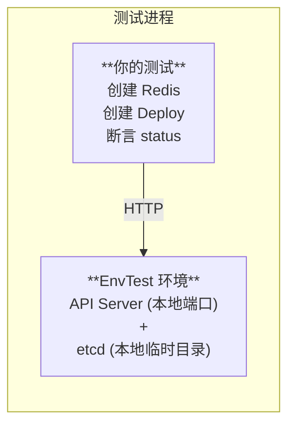
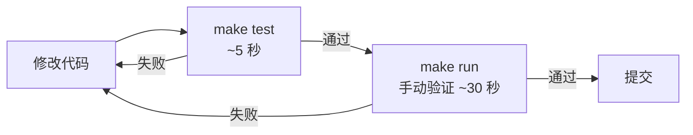

# 第 9 章：测试与调试

Operator 是跑在 K8S 集群里的，但每一轮开发都构建镜像、推送、部署会很慢。本章介绍高效的本地测试和调试方法。

## 9.1 开发循环速度对比

| 方式 | 单次修改耗时 | 适用场景 |
|------|-------------|---------|
| envtest | ~5 秒 | TDD、单元测试、集成测试 |
| `make run` 本地运行 | ~10 秒 | 快速验证功能 |
| 构建 + deploy | ~5 分钟 | CI/CD、端到端验证 |
| 远程调试 (Delve) | 实时 | 疑难 Bug 定位 |

## 9.2 EnvTest — 单元测试和集成测试

EnvTest 是 controller-runtime 提供的测试框架，它在本地启动一个**真实但精简的 K8S API Server 和 etcd**。不需要 Docker，不需要集群。

### 概念



### 安装 EnvTest 依赖

```bash
# 下载 envtest 二进制文件（API Server + etcd + kubectl）
# 自动下载到合适的路径
go install sigs.k8s.io/controller-runtime/tools/setup-envtest@latest
setup-envtest use 1.28  # 指定 K8S 版本
```

### 编写测试套件

Kubebuilder 会生成一个测试文件 `internal/controller/suite_test.go`，你可以修改它：

```go
// internal/controller/suite_test.go
package controller

import (
    "path/filepath"
    "testing"

    . "github.com/onsi/ginkgo/v2"
    . "github.com/onsi/gomega"
    "k8s.io/client-go/kubernetes/scheme"
    "k8s.io/client-go/rest"
    "sigs.k8s.io/controller-runtime/pkg/client"
    "sigs.k8s.io/controller-runtime/pkg/envtest"
    logf "sigs.k8s.io/controller-runtime/pkg/log"
    "sigs.k8s.io/controller-runtime/pkg/log/zap"

    cachev1 "github.com/YOUR_USERNAME/redis-operator/api/v1"
)

var (
    cfg       *rest.Config
    k8sClient client.Client
    testEnv   *envtest.Environment
)

func TestControllers(t *testing.T) {
    RegisterFailHandler(Fail)
    RunSpecs(t, "Controller Suite")
}

var _ = BeforeSuite(func() {
    logf.SetLogger(zap.New(zap.WriteTo(GinkgoWriter), zap.UseDevMode(true)))

    // 创建 EnvTest 环境
    testEnv = &envtest.Environment{
        // CRD 路径：指向项目生成的 CRD YAML
        CRDDirectoryPaths: []string{
            filepath.Join("..", "..", "config", "crd", "bases"),
        },
        // 如果项目使用了 Webhook，需要这一步
        ErrorIfCRDPathMissing: true,
    }

    // 启动 API Server 和 etcd
    var err error
    cfg, err = testEnv.Start()
    Expect(err).NotTo(HaveOccurred())
    Expect(cfg).NotTo(BeNil())

    // 注册 CRD
    err = cachev1.AddToScheme(scheme.Scheme)
    Expect(err).NotTo(HaveOccurred())

    // 创建 Client
    k8sClient, err = client.New(cfg, client.Options{Scheme: scheme.Scheme})
    Expect(err).NotTo(HaveOccurred())
    Expect(k8sClient).NotTo(BeNil())
})

var _ = AfterSuite(func() {
    // 关闭 EnvTest
    err := testEnv.Stop()
    Expect(err).NotTo(HaveOccurred())
})
```

### 编写 Controller 测试

```go
// internal/controller/redis_controller_test.go
package controller

import (
    "context"
    "time"

    . "github.com/onsi/ginkgo/v2"
    . "github.com/onsi/gomega"
    appsv1 "k8s.io/api/apps/v1"
    corev1 "k8s.io/api/core/v1"
    metav1 "k8s.io/apimachinery/pkg/apis/meta/v1"
    "k8s.io/apimachinery/pkg/types"

    cachev1 "github.com/YOUR_USERNAME/redis-operator/api/v1"
)

var _ = Describe("Redis Controller", func() {
    const (
        RedisName      = "test-redis"
        RedisNamespace = "default"
        timeout        = time.Second * 10
        interval       = time.Millisecond * 250
    )

    ctx := context.Background()

    BeforeEach(func() {
        // 每个测试用例前清理环境
    })

    AfterEach(func() {
        // 清理测试资源
    })

    Context("When creating a Redis resource", func() {
        It("Should create a Deployment and Service", func() {
            // 1. 创建 Redis CR
            redis := &cachev1.Redis{
                ObjectMeta: metav1.ObjectMeta{
                    Name:      RedisName,
                    Namespace: RedisNamespace,
                },
                Spec: cachev1.RedisSpec{
                    Version:  "7.0",
                    Replicas: 1,
                    Memory:   "512Mi",
                },
            }
            Expect(k8sClient.Create(ctx, redis)).Should(Succeed())

            // 2. 等待 Deployment 被创建
            deployLookupKey := types.NamespacedName{
                Name:      RedisName,
                Namespace: RedisNamespace,
            }
            createdDeploy := &appsv1.Deployment{}

            Eventually(func() bool {
                err := k8sClient.Get(ctx, deployLookupKey, createdDeploy)
                return err == nil
            }, timeout, interval).Should(BeTrue())

            // 3. 验证 Deployment 规格
            Expect(*createdDeploy.Spec.Replicas).Should(Equal(int32(1)))
            Expect(createdDeploy.Spec.Template.Spec.Containers[0].Image).
                Should(Equal("redis:7.0"))

            // 4. 验证 Service 被创建
            svcLookupKey := types.NamespacedName{
                Name:      RedisName,
                Namespace: RedisNamespace,
            }
            createdSvc := &corev1.Service{}

            Eventually(func() bool {
                err := k8sClient.Get(ctx, svcLookupKey, createdSvc)
                return err == nil
            }, timeout, interval).Should(BeTrue())

            // 5. 验证 Service 端口
            Expect(createdSvc.Spec.Ports[0].Port).Should(Equal(int32(6379)))
        })

        It("Should update the Redis status to Running", func() {
            lookupKey := types.NamespacedName{
                Name:      RedisName,
                Namespace: RedisNamespace,
            }
            updatedRedis := &cachev1.Redis{}

            Eventually(func() string {
                k8sClient.Get(ctx, lookupKey, updatedRedis)
                return string(updatedRedis.Status.Phase)
            }, timeout, interval).Should(Equal("Running"))
        })
    })

    Context("When updating a Redis resource", func() {
        It("Should scale the Deployment", func() {
            lookupKey := types.NamespacedName{
                Name:      RedisName,
                Namespace: RedisNamespace,
            }

            // 1. 更新 CR 的副本数
            var redis cachev1.Redis
            Expect(k8sClient.Get(ctx, lookupKey, &redis)).Should(Succeed())
            redis.Spec.Replicas = 3
            Expect(k8sClient.Update(ctx, &redis)).Should(Succeed())

            // 2. 等待 Deployment 副本数更新
            deploy := &appsv1.Deployment{}
            Eventually(func() int32 {
                k8sClient.Get(ctx, lookupKey, deploy)
                return *deploy.Spec.Replicas
            }, timeout, interval).Should(Equal(int32(3)))
        })
    })

    Context("When deleting a Redis resource", func() {
        It("Should clean up resources", func() {
            // 1. 删除 CR
            redis := &cachev1.Redis{
                ObjectMeta: metav1.ObjectMeta{
                    Name:      RedisName,
                    Namespace: RedisNamespace,
                },
            }
            Expect(k8sClient.Delete(ctx, redis)).Should(Succeed())

            // 2. 等待所有子资源被清理
            deploy := &appsv1.Deployment{}
            Eventually(func() bool {
                err := k8sClient.Get(ctx,
                    types.NamespacedName{Name: RedisName, Namespace: RedisNamespace},
                    deploy)
                return err != nil // 应该返回 NotFound 错误
            }, timeout, interval).Should(BeTrue())
        })
    })
})
```

### 运行测试

```bash
# 运行所有测试
make test

# 运行特定包的测试
go test ./internal/controller/... -v

# 运行特定测试
go test ./internal/controller/... -v -run "Should create a Deployment"

# 详细输出
go test ./internal/controller/... -v -ginkgo.v
```

## 9.3 本地运行 Controller

```bash
# 直接本地运行（Controller 连接到 K8S 集群）
make run

# 等价于：
# go run ./cmd/main.go

# 指定 kubeconfig
make run ARGS="--kubeconfig=$HOME/.kube/config"
```

本地运行的优势：可以加断点，使用 `log.Info()` 打印调试信息，不需要每次都构建镜像。

```go
// 在 Reconcile 中添加调试日志
func (r *RedisReconciler) Reconcile(ctx context.Context, req ctrl.Request) (ctrl.Result, error) {
    logger := log.FromContext(ctx)

    logger.Info("========== Reconcile Start ==========",
        "namespace", req.Namespace,
        "name", req.Name)

    // ... 你的逻辑 ...

    logger.Info("========== Reconcile End ==========",
        "phase", redis.Status.Phase,
        "address", redis.Status.Address)

    return ctrl.Result{}, nil
}
```

## 9.4 常见调试技巧

### 技巧 1：检查 CRD 是否安装

```bash
kubectl get crd | grep redis
kubectl describe crd redis.cache.example.com
```

### 技巧 2：检查 RBAC 权限

```bash
# 查看生成的 RBAC 规则
cat config/rbac/role.yaml

# 检查是否有权限不足的错误
kubectl logs -n redis-operator-system deployment/redis-operator-controller-manager
# 常见错误：User "system:serviceaccount:..." cannot create resource "deployments"
```

### 技巧 3：查看 Webhook 日志

```bash
kubectl logs -n cert-manager deployment/cert-manager-webhook
```

### 技巧 4：检查 Webhook 证书

```bash
kubectl get certificate -A
kubectl describe certificate -A
```

### 技巧 5：模拟最终状态一致性

```go
// 在测试中验证 Reconcile 的幂等性
It("Should be idempotent", func() {
    // 执行两次 Reconcile
    result1, err1 := reconciler.Reconcile(ctx, req)
    result2, err2 := reconciler.Reconcile(ctx, req)

    // 两次结果应该一致
    Expect(err1).NotTo(HaveOccurred())
    Expect(err2).NotTo(HaveOccurred())
    Expect(result1).To(Equal(result2))
})
```

### 技巧 6：使用 events 记录关键操作

```go
import "sigs.k8s.io/controller-runtime/pkg/event"
import "k8s.io/client-go/tools/record"

// 在 Controller 中添加 Event Recorder
type RedisReconciler struct {
    client.Client
    Scheme   *runtime.Scheme
    Recorder record.EventRecorder  // 添加这个
}

// 在 Reconcile 中记录事件
r.Recorder.Event(&redis, corev1.EventTypeNormal, "Creating",
    fmt.Sprintf("Creating Deployment %s", redis.Name))
r.Recorder.Event(&redis, corev1.EventTypeWarning, "Failed",
    fmt.Sprintf("Failed to create Service: %v", err))
```

然后可以通过 `kubectl describe redis my-redis` 看到事件：

```
Events:
  Type    Reason    Age   From            Message
  ----    ------    ----  ----            -------
  Normal  Creating  2m    redis-operator  Creating Deployment my-redis
  Normal  Created   2m    redis-operator  Deployment created successfully
```

## 9.5 常见问题排查

### 问题 1: Controller 没有收到事件

```bash
# 检查 Controller 的日志
kubectl logs -n redis-operator-system deployment/redis-operator-controller-manager -f

# 检查 Pod 是否在运行
kubectl get pods -n redis-operator-system
```

常见原因：
- RBAC 权限不足（`get;list;watch` 没有配全）
- CRD 没有正确安装
- 资源不在 Controller 监控的 namespace 中

### 问题 2: Reconcile 不断重试

```bash
# 如果 Reconcile 一直返回 error，会以指数退避重试
# 查看日志确认错误原因
kubectl logs ... | grep ERROR

# 解决后，重试自动停止
```

### 问题 3: Webhook 不生效

```bash
# 检查 cert-manager 是否正常
kubectl get pods -n cert-manager

# 检查 Webhook 配置
kubectl get validatingwebhookconfigurations
kubectl describe validatingwebhookconfigurations <name>

# 检查证书
kubectl get certificate -A
```

## 9.6 本章小结

| 测试层级 | 工具 | 速度 | 覆盖范围 |
|---------|------|------|---------|
| 单元测试 | 标准 Go 测试 | 毫秒 | 单个函数 |
| 集成测试 | EnvTest + Ginkgo | 秒级 | Controller 完整流程 |
| 本地运行 | `make run` | 秒级 | 手动验证 |
| E2E 测试 | 真实集群 | 分钟级 | 包括 Webhook、网络等 |

推荐的开发流程：



下一章，我们学习如何部署 Operator 到生产环境。
