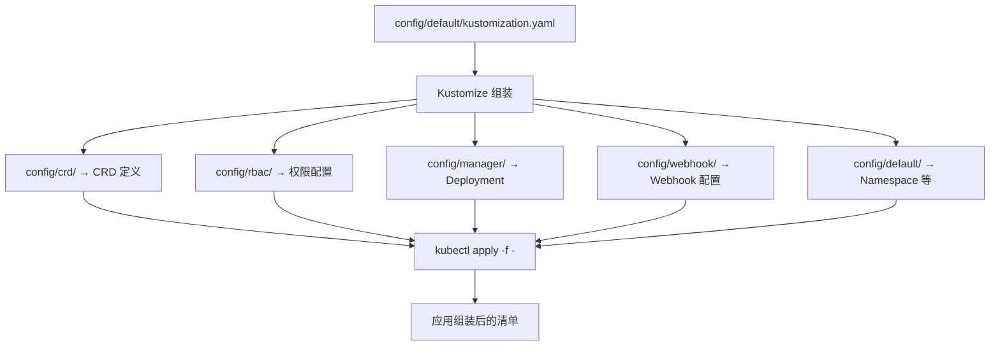
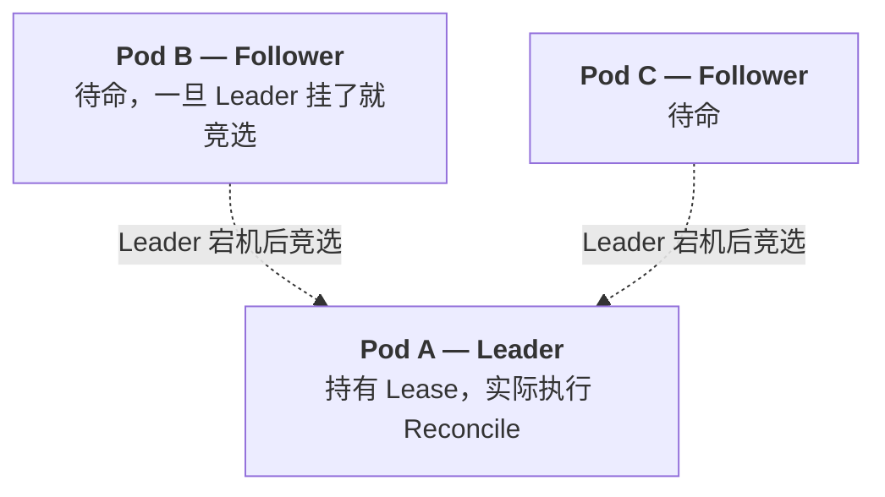
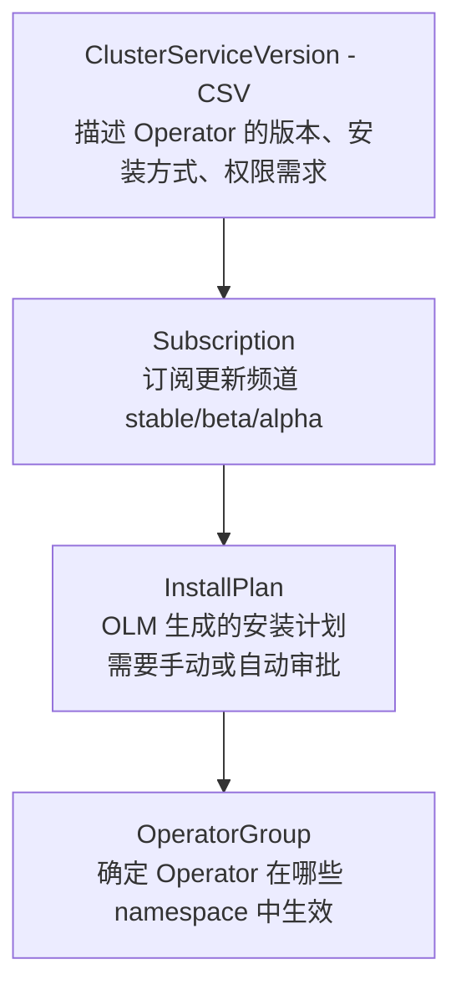
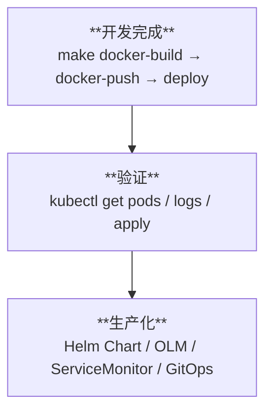

# 第 10 章：部署与发布

Operator 写好了，测试通过了，现在把它部署到生产环境。

## 10.1 部署方式概览

| 方式 | 复杂度 | 适用场景 |
|------|--------|---------|
| `make deploy` | 低 | 开发/测试环境 |
| Helm Chart | 中 | 生产环境、CI/CD |
| OLM（Operator Lifecycle Manager） | 高 | 多租户、升级管理、OperatorHub |

## 10.2 使用 make deploy 部署

这是 Kubebuilder 内置的最简单部署方式：

```bash
# 1. 构建 Docker 镜像
make docker-build IMG=registry.example.com/redis-operator:v0.1.0

# 2. 推送到镜像仓库
make docker-push IMG=registry.example.com/redis-operator:v0.1.0

# 3. 部署到当前 kubectl 上下文指向的集群
make deploy IMG=registry.example.com/redis-operator:v0.1.0

# 4. 验证部署
kubectl get deployment -n redis-operator-system
kubectl get pods -n redis-operator-system
kubectl logs -n redis-operator-system deployment/redis-operator-controller-manager
```

`make deploy` 做了什么：



### 自定义镜像名称

Kubebuilder 生成的 Makefile 中已经定义好了：

```makefile
# 镜像名称（替换为你的仓库地址）
IMG ?= controller:latest

# 构建
.PHONY: docker-build
docker-build:
	docker build -t ${IMG} .

# 推送
.PHONY: docker-push
docker-push:
	docker push ${IMG}

# 部署
.PHONY: deploy
deploy: manifests kustomize
	cd config/manager && $(KUSTOMIZE) edit set image controller=${IMG}
	$(KUSTOMIZE) build config/default | kubectl apply -f -
```

## 10.3 使用 kind 做本地部署测试

如果用的是 kind 集群，不需要推送到远程仓库：

```bash
# 1. 构建镜像
make docker-build IMG=redis-operator:local

# 2. 加载镜像到 kind
kind load docker-image redis-operator:local --name crd-dev

# 3. 部署
make deploy IMG=redis-operator:local
```

## 10.4 关键部署配置详解

### config/manager/manager.yaml — Controller 部署配置

```yaml
apiVersion: apps/v1
kind: Deployment
metadata:
  name: controller-manager
  namespace: redis-operator-system
  labels:
    control-plane: controller-manager
spec:
  selector:
    matchLabels:
      control-plane: controller-manager
  replicas: 1  # ← 通常 1 个就够了（Leader Election 保证高可用）
  template:
    metadata:
      annotations:
        kubectl.kubernetes.io/default-container: manager
      labels:
        control-plane: controller-manager
    spec:
      securityContext:
        runAsNonRoot: true  # 安全最佳实践
      containers:
      - name: manager
        image: controller:latest
        args:
        - "--leader-elect"           # 启用 Leader Election
        - "--health-probe-bind-address=:8081"
        - "--metrics-bind-address=127.0.0.1:8080"  # 只监听本地
        ports:
        - containerPort: 9443
          name: webhook-server
          protocol: TCP
        livenessProbe:
          httpGet:
            path: /healthz
            port: 8081
          initialDelaySeconds: 15
          periodSeconds: 20
        readinessProbe:
          httpGet:
            path: /readyz
            port: 8081
          initialDelaySeconds: 5
          periodSeconds: 10
        resources:
          limits:
            cpu: 500m
            memory: 128Mi  # Operator 通常很轻量
          requests:
            cpu: 50m
            memory: 64Mi
      serviceAccountName: controller-manager
      terminationGracePeriodSeconds: 10
```

### Leader Election — 多副本部署

```go
// cmd/main.go
mgr, err := ctrl.NewManager(ctrl.GetConfigOrDie(), ctrl.Options{
    LeaderElection:         true,
    LeaderElectionID:       "redis-operator.example.com",
    LeaderElectionNamespace: "redis-operator-system",
    // ...
})
```

Leader Election 的工作原理：



Lease 对象：

```yaml
apiVersion: coordination.k8s.io/v1
kind: Lease
metadata:
  name: redis-operator.example.com
  namespace: redis-operator-system
spec:
  holderIdentity: redis-operator-controller-manager-xxx  # 当前 Leader
  leaseDurationSeconds: 15
  acquireTime: "2024-01-15T10:00:00Z"
  renewTime: "2024-01-15T10:05:00Z"
```

## 10.5 多架构镜像

如果你的集群有 ARM 和 x86 节点混部：

```makefile
# 构建多架构镜像
.PHONY: docker-buildx
docker-buildx:
	docker buildx build --platform linux/amd64,linux/arm64 \
		-t ${IMG} --push .
```

## 10.6 Helm Chart 部署（进阶）

Kubebuilder 生成的 YAML 比较原始，Helm 提供了模板化、值传递、发布管理等功能。

### Chart 结构

```
helm/redis-operator/
├── Chart.yaml
├── values.yaml
├── templates/
│   ├── deployment.yaml
│   ├── serviceaccount.yaml
│   ├── rbac.yaml
│   ├── webhook.yaml
│   └── crd.yaml
└── README.md
```

### values.yaml

```yaml
# 镜像配置
image:
  repository: registry.example.com/redis-operator
  tag: v0.1.0
  pullPolicy: IfNotPresent

# 副本数
replicaCount: 1

# 资源限制
resources:
  limits:
    cpu: 500m
    memory: 128Mi
  requests:
    cpu: 50m
    memory: 64Mi

# Leader Election
leaderElection:
  enabled: true

# Webhook
webhook:
  enabled: true
  port: 9443

# 监控
monitoring:
  metricsPort: 8080
  healthProbePort: 8081

# RBAC
rbac:
  create: true

# 节点选择
nodeSelector: {}
tolerations: []
affinity: {}
```

### 安装和升级

```bash
# 安装
helm install redis-operator ./helm/redis-operator \
  --namespace redis-operator-system \
  --create-namespace

# 升级
helm upgrade redis-operator ./helm/redis-operator \
  --set image.tag=v0.2.0

# 回滚
helm rollback redis-operator 1

# 卸载
helm uninstall redis-operator -n redis-operator-system
```

## 10.7 Operator Lifecycle Manager（OLM）

OLM 是 Kubernetes 官方的 Operator 管理框架，提供：

- Operator 的发现和安装（类似 App Store）
- 依赖管理（Operator A 依赖 Operator B）
- 升级策略（手动/自动）
- 多租户隔离

### OLM 的核心概念



### 安装 OLM

```bash
# 安装 OLM
curl -sL https://github.com/operator-framework/operator-lifecycle-manager/releases/download/v0.26.0/install.sh | bash -s v0.26.0

# 验证
kubectl get pods -n olm
kubectl get crd | grep operators.coreos.com
```

### 为 Operator 生成 OLM 清单

```bash
# 安装 operator-sdk CLI
brew install operator-sdk

# 创建 OLM bundle
operator-sdk generate kustomize manifests
operator-sdk generate bundle \
  --version 0.1.0 \
  --channels stable

# 这会在 bundle/ 目录下生成：
# bundle/
# ├── manifests/
# │   ├── redis-operator.clusterserviceversion.yaml  # CSV
# │   └── cache.example.com_redis.yaml               # CRD
# ├── metadata/
# │   └── annotations.yaml
# └── tests/
#     └── scorecard/
```

## 10.8 监控与可观测性

### Metrics 端点

Controller 自带 Prometheus 指标，位于 `:8080/metrics`：

```
# 核心指标
controller_runtime_reconcile_total          # Reconcile 总次数
controller_runtime_reconcile_errors_total    # Reconcile 错误次数
controller_runtime_reconcile_time_seconds    # Reconcile 耗时分布
workqueue_depth                              # WorkQueue 当前深度
workqueue_adds_total                         # WorkQueue 入队次数
workqueue_retries_total                      # WorkQueue 重试次数
```

### 在 main.go 中暴露指标

```go
// 默认已启用
mgr, err := ctrl.NewManager(ctrl.GetConfigOrDie(), ctrl.Options{
    MetricsBindAddress: ":8080",  // 这是默认值
    // ...
})
```

### ServiceMonitor（Prometheus Operator 集成）

```yaml
# config/prometheus/monitor.yaml
apiVersion: monitoring.coreos.com/v1
kind: ServiceMonitor
metadata:
  name: redis-operator
  namespace: redis-operator-system
spec:
  selector:
    matchLabels:
      control-plane: controller-manager
  endpoints:
    - port: metrics
      interval: 30s
      path: /metrics
```

### 自定义指标

```go
// 在 Controller 中暴露业务指标
var (
    redisInstances = prometheus.NewGauge(
        prometheus.GaugeOpts{
            Name: "redis_operator_instances_total",
            Help: "Total number of Redis instances managed",
        },
    )
)

func init() {
    metrics.Registry.MustRegister(redisInstances)
}

// 在 Reconcile 中更新
func (r *RedisReconciler) Reconcile(...) {
    // ...
    redisInstances.Set(float64(countInstances(ctx, r.Client)))
}
```

## 10.9 生产部署检查清单

| 项目 | 检查内容 | 命令/配置 |
|------|---------|----------|
| 镜像安全 | 基础镜像已更新、无严重 CVE | `docker scan` |
| 资源限制 | CPU/Memory limits 已配置 | `manager.yaml` |
| RBAC | 最小权限原则 | `kubectl auth can-i --list` |
| 安全上下文 | `runAsNonRoot: true` | `manager.yaml` |
| Leader Election | 已启用 | `--leader-elect` 参数 |
| 健康检查 | Liveness/Readiness Probe | `manager.yaml` |
| 日志级别 | 生产用 info，不用 debug | `--zap-log-level=info` |
| Webhook | cert-manager 正常运行 | `kubectl get pods -n cert-manager` |
| 监控 | Metrics 端点可访问 | `curl :8080/metrics` |
| 备份 | CR 数据有备份 | etcd 备份或 GitOps |

## 10.10 本章小结



---

## 教程总结

恭喜你完成了整个教程！回顾一下你学到了什么：

1. **CRD** 是扩展 Kubernetes 的方法，让你定义自己的资源类型
2. **Controller** 通过 Informer + WorkQueue + Reconcile Loop 实现声明式管理
3. **Kubebuilder** 自动化了脚手架、代码生成、RBAC、CRD 清单等繁琐工作
4. **API 设计**需要清晰的 Spec/Status 分离、合适的校验和数据类型
5. **Reconcile** 必须是幂等的，使用 `CreateOrUpdate` 和 OwnerReference
6. **Webhook** 补充了 CRD Schema 做不到的复杂校验和默认值设置
7. **EnvTest** 提供了快速、可靠的测试环境
8. **部署**从简单的 `make deploy` 到 Helm 再到 OLM，根据场景选择

### 拓展学习方向

- **controller-runtime 源码**：深入理解 Manager、Informer、WorkQueue
- **Kubernetes API 规范**：学习 API 设计的约定和最佳实践
- **cert-manager Operator**：阅读实际生产级 Operator 的源码
- **Crossplane**：CRD/Controller 模式的另一个应用（云资源管理）
- **KEDA**：基于 CRD 的事件驱动自动伸缩

Happy Operator building! 🚀
