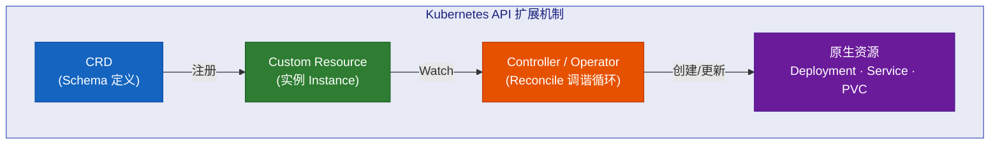

# Kubernetes CRD 与 Operator 学习教程

## 目录

1. [CRD 基础](./01-crd-basics/README.md) — 从 YAML 开始，理解自定义资源
2. [手动控制器](./02-manual-controller/README.md) — 用 Shell 脚本理解 Reconcile 循环
3. [Go Operator 实战](./03-go-operator/README.md) — kubebuilder 脚手架 + controller-runtime 构建生产级 Operator
4. [进阶主题](./04-advanced/README.md) — Webhook、Status、多版本转换等

---

## 前置知识

- 熟悉 `kubectl` 基本操作（get, describe, apply, delete）
- 了解 Kubernetes 核心资源：Deployment, Service, Pod
- 了解 Go 语言基础（第3章需要）

## 环境准备

你已经有远端 Kubernetes 集群（context: `f2e-k8s-cluster`），确保：

```bash
# 切换到目标集群
kubectl config use-context f2e-k8s-cluster

# 验证集群连通性
kubectl cluster-info
kubectl get nodes
```

> **注意**：整个教程中的命令默认都在 `f2e-k8s-cluster` 上下文中执行。

## 你将会学到什么



**核心理念**：CRD 定义"你想要什么"，Operator 负责"如何实现它"。

## 为什么需要 CRD 和 Operator？

传统方式部署一个应用需要手动创建 Deployment、Service、ConfigMap、Ingress 等多个资源。如果这个应用还有生命周期管理（备份、扩缩容、升级），运维工作非常繁琐。

CRD + Operator 将运维知识代码化：
- **CRD**：定义你的自定义资源的 Schema（比如 `AppService`）
- **Operator**：观察 CR 的变化，自动创建/更新/删除底层 Kubernetes 资源

## 学习路线

| 阶段 | 内容 | 时间 |
|------|------|------|
| 01 CRD 基础 | 编写 CRD YAML，创建自定义资源 | 30 分钟 |
| 02 手动控制器 | 用 Shell 理解 Reconcile 循环 | 30 分钟 |
| 03 Go Operator | kubebuilder/controller-runtime 实战 | 1-2 小时 |
| 04 进阶 | Webhook、Status、Finalizer 等 | 1 小时 |

开始学习 → [01-crd-basics](./01-crd-basics/README.md)
